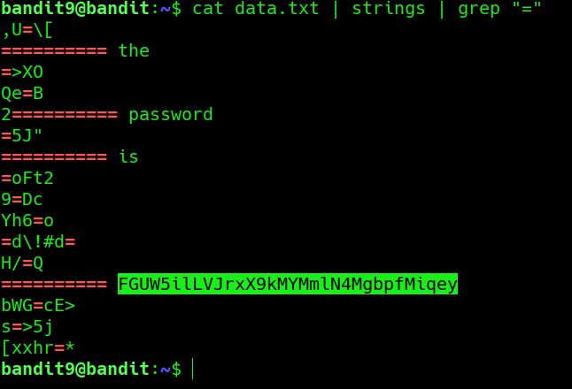

## Bandit Level 9 → 10

**Concept:** Extracting readable content from binary data

**Difficulty:** Trivial

### What the level asks

Retrieve the password stored in `data.txt` within one of the few human-readable strings that is preceded by several `=` characters.

### Solution

```bash
cat data.txt | strings | grep "="
# Extract human-readable strings from the file
# Filter the results for strings containing '=' characters

# Password obtained:
# [REDACTED]
```

### Screenshot



**Caption:** Extracting human-readable strings from mixed data.

The `strings` command filtered readable text from the file contents, while `grep "="` narrowed the results to entries matching the challenge criteria. This revealed the line containing the password.

### Real-world relevance

Security analysts frequently examine binaries, memory dumps, malware samples, and unknown files for embedded strings. The `strings` utility is often used during triage to identify credentials, URLs, command-and-control indicators, or other artifacts hidden within non-text files.
