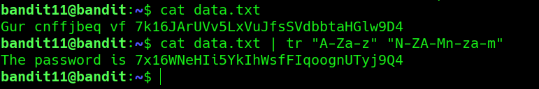

## Bandit Level 11 → 12

**Concept:** Decoding ROT13-encoded text

**Difficulty:** Trivial

### What the level asks

Retrieve the password stored in a file where all alphabetic characters have been rotated by 13 positions.

### Solution

```bash
cat data.txt
# Inspect the encoded text

cat data.txt | tr 'A-Za-z' 'N-ZA-Mn-za-m'
# Apply a ROT13 transformation to decode the message

# Password obtained:
# [REDACTED]
```
### Screenshot



**Caption:** Decoding a ROT13-encoded message using the tr command.

Explanation: The contents of data.txt were encoded using ROT13. Applying the appropriate character translation revealed the original text and exposed the password for the next level.

### Real-world relevance

ROT13 is a simple substitution cipher that occasionally appears in security challenges, obfuscated scripts, log artifacts, and training environments. Understanding basic text transformations helps analysts recognize and decode lightly obfuscated data during investigations.
