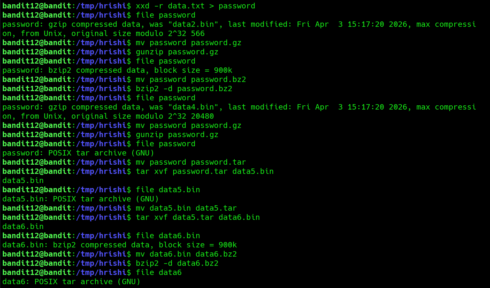
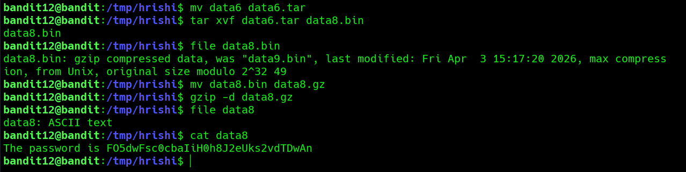

## Bandit Level 12 → 13

**Concept:** File format identification and layered decompression

**Difficulty:** Non-trivial

### What the level asks

The provided file is a hexadecimal dump of data that has been compressed multiple times using different formats. The goal is to reconstruct the original file and repeatedly identify and extract each layer until the password is revealed.

### Approach

I first created a temporary working directory to avoid modifying files in my home directory. After copying the challenge file, I noticed the contents were presented as a hexadecimal dump rather than a normal file. Using `xxd -r`, I reconstructed the original binary and then relied on `file` to determine what type of data I was dealing with.

The key observation was that each extraction step revealed another layer rather than the final answer. Every time I decompressed or extracted a file, I immediately checked it again with `file` before deciding what command to use next. This process repeated through multiple gzip, bzip2, and tar layers until the final file was identified as plain ASCII text.

### Solution

```bash
mkdir /tmp/hrishi
# Create a temporary workspace

cp data.txt /tmp/hrishi/data.txt
# Copy the challenge file into the workspace

cd /tmp/hrishi

xxd -r data.txt > password
# Reconstruct the original binary from the hexadecimal dump

file password
# Identify the file format

mv password password.gz
gunzip password.gz
# Extract gzip-compressed content

file password
# Identify the next format

mv password password.bz2
bzip2 -d password.bz2
# Extract bzip2-compressed content

file password
# Identify the next format

mv password password.tar
tar xvf password.tar
# Extract tar archive contents

# Repeat:
# file
# rename
# decompress/extract
# until a plain text file is reached

cat data8
# Read the final text file

# Password obtained:
# [REDACTED]
```

### Screenshot



**Caption:** Identifying compression layers using file signatures.

After reconstructing the original binary from the hexdump with `xxd -r`, I repeatedly used the `file` utility to determine the next archive or compression format. Each output dictated the next extraction step in the chain.

### Screenshot



**Caption:** Reaching the final plaintext after multiple decompression stages.

Successive extraction and decompression operations eventually revealed a plain text file. Reading this final artifact exposed the password required for the next level.

### Real-world relevance

This level closely mirrors real-world forensic and malware-analysis workflows. Security analysts frequently encounter nested archives, encoded payloads, and compressed artifacts that must be unpacked layer by layer before meaningful content can be examined. The ability to identify file signatures and safely process unknown files is a fundamental skill in incident response and threat analysis.
