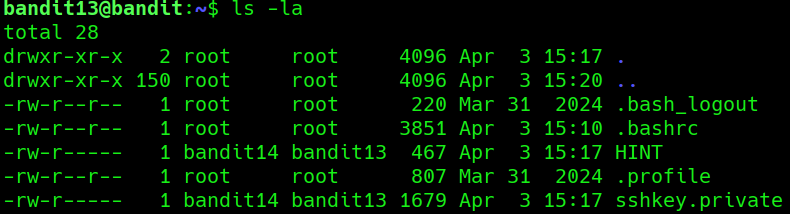
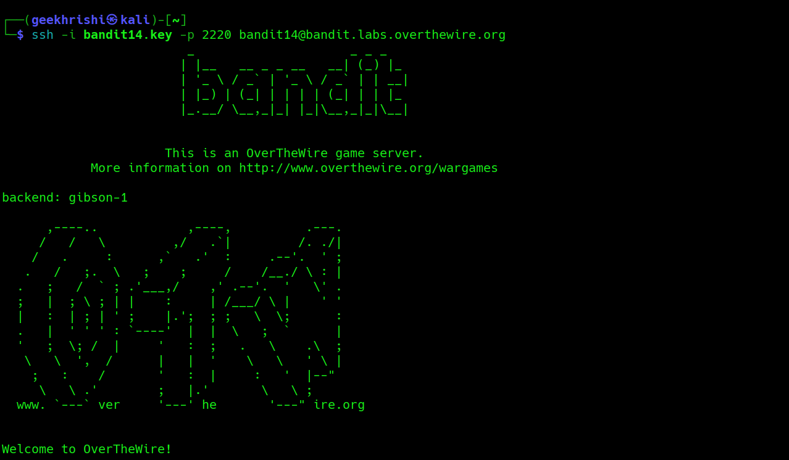

# Bandit Level 13 → 14

**Concept:** SSH Private Key Authentication

**Difficulty:** Non-trivial

## What the level asks

The password for the next level is not directly stored in a readable file. Instead, the current account contains a private SSH key that must be used to authenticate as the next user.

## Approach

After listing the contents of the home directory, I noticed a file named `sshkey.private`. Reading the accompanying `HINT` file confirmed that this level involved authentication rather than password extraction.

Inspecting `sshkey.private` revealed an RSA private key. Since SSH private keys can be used for authentication, I copied the entire key and saved it locally on my Kali Linux machine as `bandit14.key`.

I then used this key with the SSH client to authenticate directly as `bandit14`. After successfully logging in, I verified the account identity and retrieved the password for the next level.

## Solution

```bash
ls -la
# Enumerate files in the home directory

cat HINT
# Read the level instructions

cat sshkey.private
# Display the RSA private key
```

Save the key locally:

```bash
nano bandit14.key
# Paste the complete private key

chmod 600 bandit14.key
# Restrict permissions on the private key
```

Authenticate using the key:

```bash
ssh -i bandit14.key -p 2220 bandit14@bandit.labs.overthewire.org
# Login using key-based authentication

whoami
# Verify current user

cat /etc/bandit_pass/bandit14
# Retrieve the next password
```

```text
# Password obtained:
# [REDACTED]
```

## Screenshot



**Caption:** Discovering the private SSH key inside the Bandit13 account.

The home directory contained an RSA private key file that would later be used for authentication as the next user.

## Screenshot



**Caption:** Authenticating to Bandit14 using key-based SSH authentication.

After saving the private key locally, the SSH client successfully authenticated as bandit14 without requiring a password.

## Real-world relevance

SSH key-based authentication is widely used in Linux administration, cloud environments, DevOps pipelines, and security operations. Security professionals frequently encounter private keys during penetration tests, incident response investigations, and privilege escalation scenarios. Understanding how SSH keys are stored, protected, and used for authentication is an essential operational skill.
