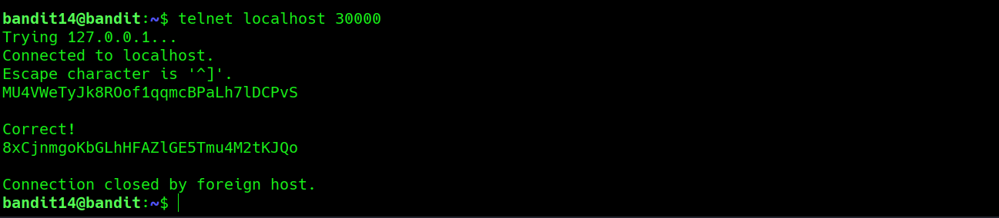
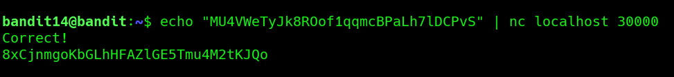

# Bandit Level 14 → Level 15

**Concept:** Connecting to a Local TCP Service

**Difficulty:** Non-trivial

## What the level asks

The password for the next level can be retrieved by submitting the current level's password to a service listening on port `30000` on `localhost`.

## Approach

This level introduces the concept of network services running on specific TCP ports. The challenge requires connecting to a service on the local machine and providing the current password. Once the correct password is submitted, the service responds with the password for the next level.

I tested two different methods:

* Interactive connection using Telnet
* Direct submission using Netcat (nc)

Both methods successfully returned the password for Bandit15.

## Solution (Method 1 – Telnet)

```bash
telnet localhost 30000
```

After the connection is established, enter the current password:

```text
MU4VWeTyJk8ROof1qqmcBPaLh7lDCPvS
```

The service responds:

```text
Correct!
<Bandit15 Password>
```

### Screenshot



**Caption:** Connecting to the local TCP service using Telnet.

**Explanation:** The Telnet client establishes a connection to port 30000 on localhost. After submitting the current password, the service validates the input and returns the password for the next level.

---

## Solution (Method 2 – Netcat)

```bash
echo "MU4VWeTyJk8ROof1qqmcBPaLh7lDCPvS" | nc localhost 30000
```

Output:

```text
Correct!
<Bandit15 Password>
```

### Screenshot



**Caption:** Using Netcat to send the password directly to the service.

**Explanation:** Netcat provides a faster way to interact with TCP services by piping the password directly into the connection without requiring an interactive session.

## Real-World Relevance

Many network services listen on specific TCP ports and expect input from clients. Security professionals commonly use tools such as Telnet and Netcat to test connectivity, validate services, troubleshoot applications, and interact with network protocols during security assessments.
