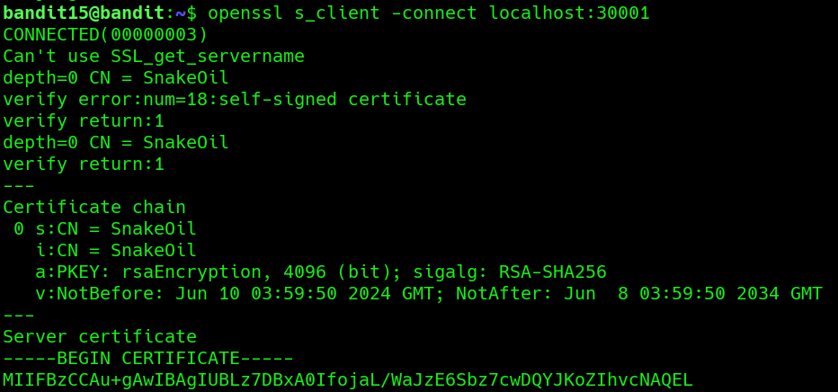

# Bandit Level 15 → Level 16

**Concept:** SSL/TLS Encrypted Communication

**Difficulty:** Non-trivial

## What the level asks

The password for the next level can be retrieved by submitting the current password to a service listening on port `30001`. Unlike the previous level, the connection must use SSL/TLS encryption.

## Approach

A normal TCP connection is insufficient because the service requires an encrypted TLS session. To communicate securely with the service, I used OpenSSL's client utility.

After establishing the TLS connection, OpenSSL displayed the server certificate information. Although the certificate is self-signed, communication can still continue. Once the current password was submitted through the encrypted channel, the service returned the password for the next level.

## Solution

```bash
openssl s_client -connect localhost:30001
```

After the TLS connection is established, enter the current password:

```text
8xCjmmgOKbGLhHFAZlGE5Tmu4M2tKJ0Q
```

The server responds:

```text
Correct!
<Bandit16 Password>
```

### Screenshot



**Caption:** Establishing an SSL/TLS connection to the service on port 30001.

**Explanation:** OpenSSL successfully negotiates a TLS session and displays certificate details, confirming that communication with the service is encrypted.

### Screenshot


**Caption:** Submitting the password through the encrypted TLS session.

**Explanation:** After the password is sent over the secure channel, the service validates the credentials and returns the password for Bandit16.

## Real-World Relevance

SSL/TLS is the foundation of secure communication across the Internet. Technologies such as HTTPS, VPNs, cloud APIs, and secure remote administration all rely on TLS encryption. OpenSSL is widely used by security engineers and penetration testers to inspect certificates, validate encryption settings, troubleshoot secure services, and manually interact with encrypted network applications.
