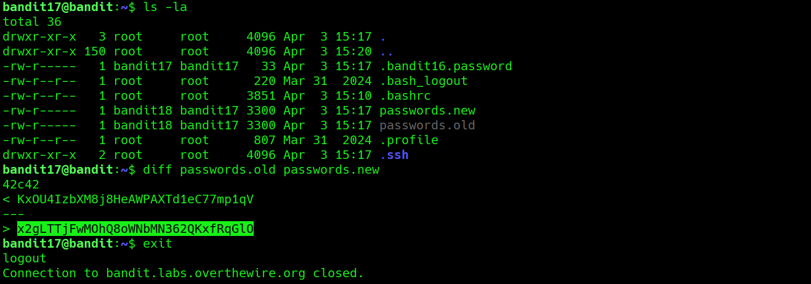

## Bandit Level 17 → Level 18

**Concept:** File Comparison and Change Detection

**Difficulty:** Trivial

## What the level asks

Two files, `passwords.old` and `passwords.new`, are present in the home directory. The password for the next level is the only line that differs between the two files.

## Approach

After listing the files in the home directory, I noticed the two password files referenced in the challenge description. Since the objective was to identify the single changed line, I used the `diff` utility to compare both files directly.

The output immediately highlighted the difference between the files. The newly added line in `passwords.new` contained the password required for the next level.

## Solution

```bash
ls -la
# Identify the files available in the home directory

diff passwords.old passwords.new
# Compare both files and display the differences

# Password obtained:
# [REDACTED]
```

### Screenshot



**Caption:** Identifying the modified entry between two file versions.

**Explanation:** The `diff` command highlights the only line that differs between `passwords.old` and `passwords.new`, allowing the updated password to be identified immediately.

## Real-World Relevance

File comparison is a common task during incident response, configuration auditing, and change management. Security analysts frequently compare configuration files, logs, and system snapshots to identify unauthorized modifications or investigate suspicious activity.
