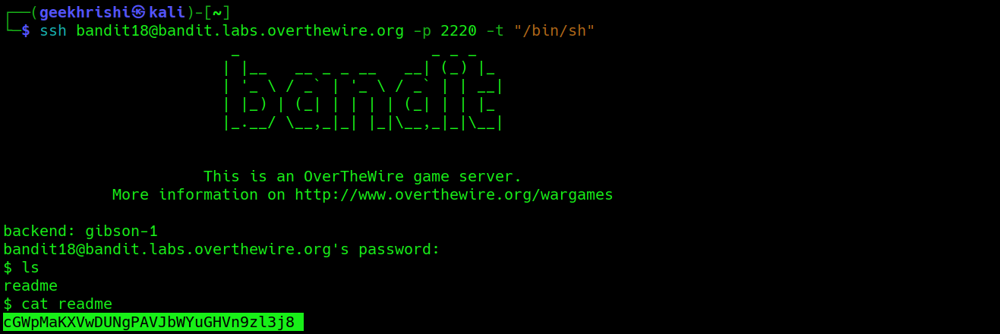

## Bandit Level 18 → Level 19

**Concept:** Bypassing Restricted Login Environments

**Difficulty:** Non-trivial

## What the level asks

Retrieve the password stored in the `readme` file. A modified `.bashrc` automatically logs users out immediately after login, preventing normal shell access.

## Approach

My first login attempt immediately terminated with a "Byebye!" message, indicating that a shell initialization script was intentionally forcing a logout.

To bypass this restriction, I instructed SSH to execute `/bin/sh` directly instead of loading the default login shell and its configuration files. This allowed me to obtain a shell without triggering the modified `.bashrc`.

Once access was established, I listed the contents of the home directory and read the `readme` file to retrieve the password.

## Solution

```bash
ssh bandit18@bandit.labs.overthewire.org -p 2220 -t "/bin/sh"
# Spawn a shell directly and bypass the modified .bashrc

ls
# View files in the home directory

cat readme
# Read the password file

# Password obtained:
# [REDACTED]
```

### Screenshot


**Caption:** Automatic logout triggered by the modified shell configuration.

**Explanation:** A normal SSH login immediately terminated the session, indicating that a startup script was intentionally restricting access.

### Screenshot



**Caption:** Bypassing the restricted login shell and accessing the password file.

**Explanation:** Executing `/bin/sh` directly prevented the modified `.bashrc` from running, allowing normal access to the account.

## Real-World Relevance

Restricted shells and login scripts are commonly used in administrative environments, containers, and hardened systems. Security professionals often encounter situations where shell behavior is modified, making it important to understand how startup scripts influence user sessions.
