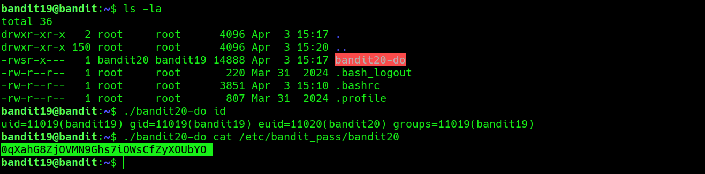

## Bandit Level 19 → Level 20

**Concept:** SetUID Privilege Escalation

**Difficulty:** Non-trivial

## What the level asks

A SetUID binary named `bandit20-do` is located in the home directory. The goal is to use this binary to access the password for Bandit20.

## Approach

After inspecting the home directory, I found a binary called `bandit20-do`. Running it without arguments displayed usage information indicating that it could execute commands as another user.

To verify its behavior, I first executed the `id` command through the binary. The output confirmed that commands were being executed with Bandit20's privileges.

Since Bandit20 can access its own password file, I used the binary to run `cat` against `/etc/bandit_pass/bandit20`, which revealed the password.

## Solution

```bash
ls -la
# Identify the SetUID binary

./bandit20-do id
# Verify which user context commands execute under

./bandit20-do cat /etc/bandit_pass/bandit20
# Read the password file using Bandit20 privileges

# Password obtained:
# [REDACTED]
```

### Screenshot



**Caption:** Using a SetUID binary to execute commands as another user.

**Explanation:** The SetUID binary executed commands with Bandit20's permissions, allowing access to files that would otherwise be restricted.

## Real-World Relevance

Misconfigured SetUID binaries are a common source of privilege escalation vulnerabilities on Linux systems. During penetration tests and security audits, identifying binaries that execute with elevated privileges is a standard step in privilege escalation assessment.
