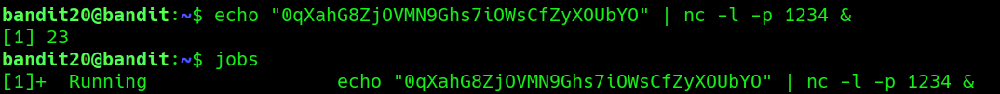

## Bandit Level 20 → Level 21

**Concept:** Local Network Services and Inter-Process Communication

**Difficulty:** Non-trivial

## What the level asks

A SetUID binary named `suconnect` connects to a localhost port specified by the user, reads a password from that connection, and compares it to the current Bandit20 password. If the password is correct, it returns the password for Bandit21.

## Approach

The challenge description indicated that the binary expected to receive the current password from a network service running on localhost.

To simulate this service, I started a Netcat listener on port `1234` and configured it to send the current Bandit20 password whenever a connection was established. I launched the listener as a background job so I could continue interacting with the terminal.

After the listener was running, I executed `suconnect` and provided the same port number. The binary connected to the listener, received the password, validated it successfully, and returned the password for the next level.

## Solution

```bash
echo "<bandit20_password>" | nc -l -p 1234 &
# Start a local listener that sends the current password

jobs
# Verify the listener is running in the background

./suconnect 1234
# Connect to the listener and validate the password

# Password obtained:
# [REDACTED]
```

### Screenshot



**Caption:** Creating a local Netcat listener to supply the password.

**Explanation:** Netcat was used to create a simple localhost service that automatically provided the current Bandit20 password when contacted.

### Screenshot


**Caption:** Successful authentication through the SetUID binary.

**Explanation:** The binary connected to the listener, validated the supplied password, and returned the password for Bandit21.

## Real-World Relevance

Many security tools, services, and applications communicate over localhost sockets. Understanding how processes exchange information using TCP connections is valuable for debugging services, analyzing software behavior, and testing authentication workflows during security assessments.
