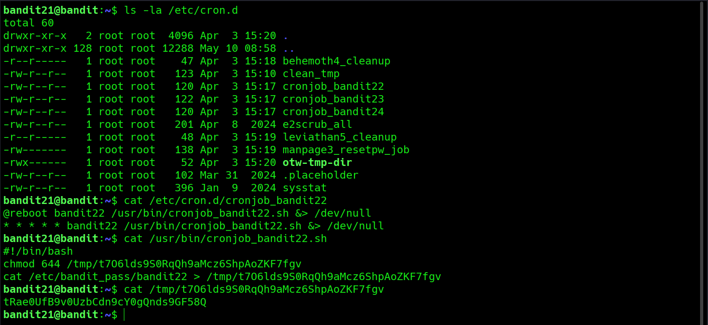

# Bandit Level 21 → Level 22

**Concept:** Scheduled Task Enumeration

**Difficulty:** Trivial

## What the level asks

A program is executed automatically through the system cron scheduler. The objective is to identify the scheduled task, determine the script being executed, and locate the password generated for the next Bandit level.

## Approach

The challenge description indicated that an automated task was running at regular intervals. The first step was to inspect the cron configuration directory at `/etc/cron.d`, which contains definitions for scheduled jobs.

Among the available entries, `cronjob_bandit22` was responsible for executing a shell script as the `bandit22` user. After examining the cron configuration, I reviewed the referenced script to understand its behavior.

The script copied the contents of `/etc/bandit_pass/bandit22` into a temporary file located in `/tmp`. Since the destination filename was hardcoded and world-readable, it was possible to directly read the file and retrieve the credentials for the next level.

## Solution

```bash
ls -la /etc/cron.d
# Enumerate scheduled tasks

cat /etc/cron.d/cronjob_bandit22
# View the cron configuration

cat /usr/bin/cronjob_bandit22.sh
# Inspect the script executed by cron

cat /tmp/t70zlds9S0RqQh9aMcz6ShpAoZKF7fgv
# Read the generated password file

# Password obtained:
# [REDACTED]
```

### Screenshot



**Caption:** Enumerating the scheduled task and identifying the password file location.

**Explanation:** The screenshot shows inspection of the cron configuration, analysis of the associated shell script, and retrieval of the password from the temporary file created by the scheduled task.

## Real-World Relevance

Scheduled tasks frequently perform maintenance, backups, monitoring, and administrative operations in production environments. Security professionals routinely inspect cron jobs during system audits and penetration tests because poorly designed automated tasks can expose sensitive information through predictable filenames, insecure permissions, or temporary storage locations.
