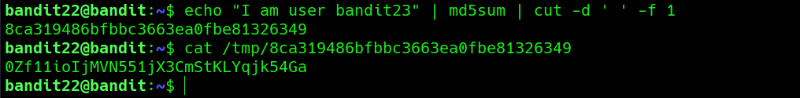

# Bandit Level 22 → Level 23

**Concept:** Script Analysis and Predictable File Generation

**Difficulty:** Trivial

## What the level asks

A cron job is executed automatically by the system. The objective is to analyze the scheduled script, understand how it generates its output, and determine where the password for the next level is stored.

## Approach

As with the previous level, the investigation began by inspecting the cron configuration stored in `/etc/cron.d`. The configuration revealed a script executed periodically by the `bandit23` user.

After reviewing the shell script, it became clear that the password file location was generated dynamically. The script constructed a string containing the username, calculated its MD5 hash, and used the resulting value as the filename under `/tmp`.

Rather than waiting for the script to execute or attempting to brute-force filenames, I reproduced the same hashing operation manually. Once the expected filename was calculated, the generated file was inspected and the password for the next level was retrieved.

## Solution

```bash
ls -a /etc/cron.d

cat /etc/cron.d/cronjob_bandit23

cat /usr/bin/cronjob_bandit23.sh

echo "I am user bandit23" | md5sum | cut -d ' ' -f 1
# Reproduce the filename generation logic

cat /tmp/8ca319486bfbbc3663ea0fbe81326349
# Read the generated password file

# Password obtained:
# [REDACTED]
```

### Screenshot



**Caption:** Reproducing the filename generation logic used by the scheduled task.

**Explanation:** The screenshot demonstrates analysis of the cron script, recreation of the MD5 hashing process used to generate the temporary filename, and retrieval of the password stored in the resulting file.

## Real-World Relevance

Security assessments frequently involve reviewing scripts written by administrators and developers. Understanding how applications generate filenames, temporary storage paths, and identifiers can reveal predictable patterns that expose sensitive data. Script analysis is therefore an important skill in both offensive security and defensive auditing.
