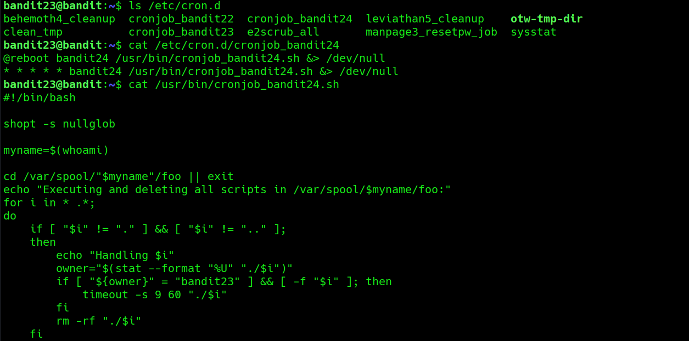
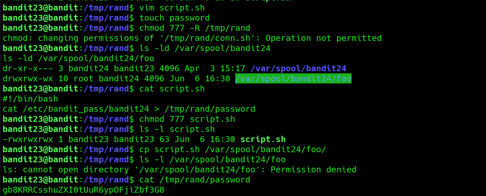

# Bandit Level 23 → Level 24

**Concept:** Scheduled Task Abuse Through User-Controlled Scripts

**Difficulty:** Non-trivial

## What the level asks

A cron job executes scripts placed within a designated directory. The objective is to understand how the scheduled task operates, create a custom script that will be executed by another user, and use that execution context to retrieve the password for the next Bandit level.

## Approach

The investigation began by examining the cron configuration responsible for the automated task. The associated shell script revealed that it periodically processed files located in a specific spool directory and executed any script owned by the `bandit23` user.

After understanding the execution flow, I created a temporary working directory and wrote a custom shell script. The script copied the contents of `/etc/bandit_pass/bandit24` into a file located in a writable temporary location.

Execution permissions were applied to the script before placing it into the monitored spool directory. Once the cron scheduler executed the script under the privileged context, the password was written to the designated output file. The generated file was then inspected to retrieve the credentials for the next level.

## Solution

```bash
cat /etc/cron.d/cronjob_bandit24

cat /usr/bin/cronjob_bandit24.sh

vim script.sh

touch password

chmod 777 script.sh

cp script.sh /var/spool/bandit24/foo/

cat /tmp/rand/password

# Password obtained:
# [REDACTED]
```

### Screenshot



**Caption:** Reviewing the scheduled task responsible for executing user-supplied scripts.

**Explanation:** The screenshot shows the cron configuration and shell script logic used to process and execute files placed in the monitored spool directory.

### Screenshot



**Caption:** Retrieving the password after successful cron-based script execution.

**Explanation:** The screenshot demonstrates creation of the custom script, placement into the monitored directory, and retrieval of the password written by the cron job after execution.

## Real-World Relevance

Misconfigured scheduled tasks can create opportunities for privilege escalation when they execute files from user-controlled locations. Security professionals routinely assess automated jobs, service accounts, and maintenance scripts because improper ownership validation or execution controls can allow attackers to run code with elevated privileges. Understanding these mechanisms is valuable for both offensive security testing and secure system administration.
