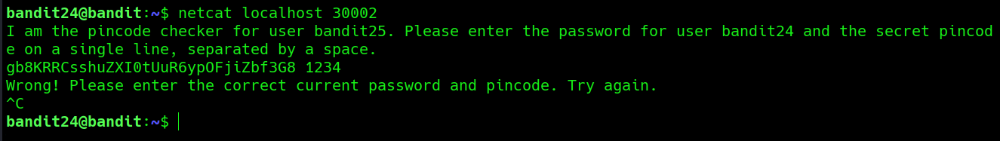
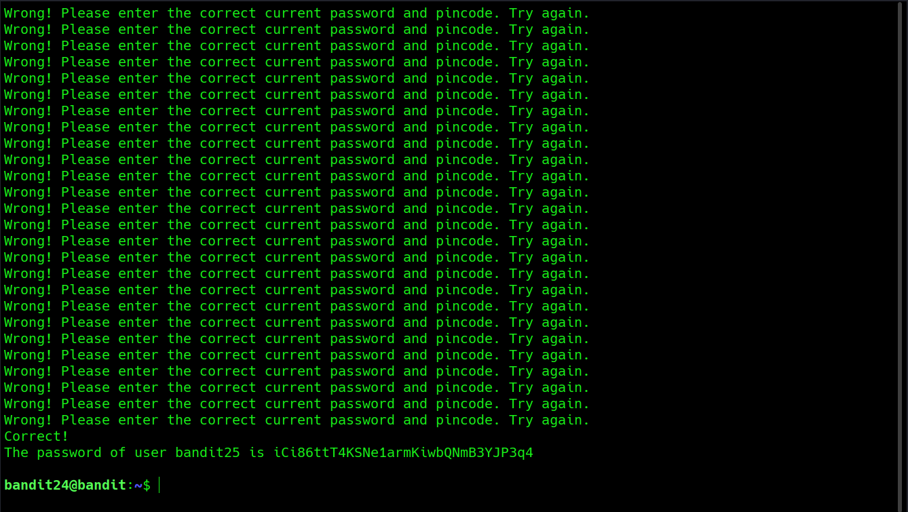

# Bandit Level 24 → Level 25

**Concept:** Brute-Force Authentication Against a Network Service

**Difficulty:** Non-trivial

## What the level asks

A service running on localhost port `30002` requires two values on a single line: the current Bandit24 password and a secret four-digit PIN. The objective is to identify the correct PIN and retrieve the password for the next level.

## Approach

The challenge description indicated that the service was accessible locally and expected a password-PIN combination. Initial interaction with the service confirmed that a valid password alone was insufficient and that an additional four-digit PIN was required.

Because the PIN consisted of only four numeric digits, the search space was limited to 10,000 possible values ranging from `0000` to `9999`. Rather than testing combinations manually, a simple shell loop was used to generate every possible PIN and submit each candidate to the service through Netcat.

The responses from the service were captured and monitored until a successful authentication occurred. Once the correct PIN was submitted alongside the current password, the service returned the password for Bandit25.

## Solution

```bash
netcat localhost 30002
# Interact with the service manually

for i in {0000..9999}; do
    echo "gb8KRRCsshuZXI0tUuR6ypOFjiZbf3G8 $i"
done | nc localhost 30002 | tee result.txt
# Submit every possible four-digit PIN and save the output

# Password obtained:
# [REDACTED]
```

### Screenshot



**Caption:** Inspecting the authentication requirements of the local service.

**Explanation:** The service prompt reveals that both the current password and a four-digit PIN are required. This information establishes the attack surface and indicates that PIN enumeration is necessary.

### Screenshot



**Caption:** Successful authentication after automated PIN enumeration.

**Explanation:** The screenshot shows repeated failed attempts followed by a successful response from the service once the correct PIN was submitted. The service then returned the password for the next level.

## Real-World Relevance

Authentication systems often rely on passwords combined with short PINs, verification codes, or secondary authentication factors. Security professionals frequently evaluate the effectiveness of such mechanisms by analyzing rate limiting, lockout controls, and resistance to automated guessing attacks. Understanding brute-force methodology is important when assessing authentication security and validating defensive controls.
