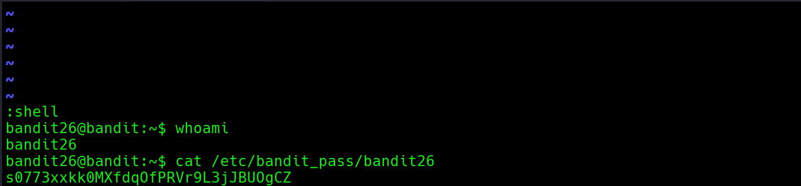

# Bandit Level 25 → Level 26

**Concept:** Restricted Shell Escape via Vim

**Difficulty:** Non-trivial

## What the level asks

The Bandit25 account contains an SSH private key that can be used to authenticate as Bandit26. However, Bandit26 is configured with a restricted login environment that immediately terminates the session after login. The objective is to obtain interactive shell access despite these restrictions.

## Approach

The home directory of Bandit25 contained a private RSA key named `bandit26.sshkey`. After examining the file, the key was copied locally and assigned the permissions required by the SSH client.

Authentication using the key was successful, but the session immediately closed. Investigation revealed that the Bandit26 account used a custom shell called `showtext`, which displayed a banner using the `more` pager and then exited.

To prevent the session from closing immediately, the terminal window was reduced in size before connecting. Because the banner could no longer fit on the screen, `more` entered interactive mode and paused for user input.

From the interactive pager, the `v` command was used to open the content in Vim. Vim provides shell escape functionality, allowing execution of arbitrary commands. By configuring Bash as the shell and launching a shell escape, a fully interactive Bash session was obtained as the Bandit26 user.

## Solution

```bash
ls
# Identify available files

cat bandit26.sshkey
# Inspect the private key

chmod 600 ~/otw/bandit26.key
# Restrict key permissions

ssh -i ~/otw/bandit26.key bandit26@bandit.labs.overthewire.org -p 2220
# Authenticate using the private key

# Reduce terminal size before login

v
# Open the pager contents in Vim

:set shell=/bin/bash
:shell
# Spawn an interactive Bash shell

whoami
# Verify user context
```

### Screenshot


**Caption:** Identifying the SSH private key used for Bandit26 authentication.

**Explanation:** The screenshot shows discovery of the private key file within the Bandit25 account and inspection of its contents prior to authentication.

### Screenshot



**Caption:** Escaping the restricted login environment through Vim shell functionality.

**Explanation:** After forcing the `more` pager into interactive mode, Vim was launched and used to obtain an interactive Bash shell. The screenshot confirms successful shell access as the Bandit26 user.

## Real-World Relevance

Restricted shells are commonly deployed to limit user capabilities in administrative, kiosk, and controlled-access environments. Security assessments often evaluate whether trusted applications such as editors, pagers, interpreters, or management interfaces can be abused to escape those restrictions. Understanding shell escape techniques is valuable when reviewing system hardening controls and privilege boundaries.
