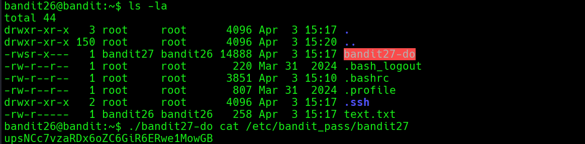

# Bandit Level 26 → Level 27

**Concept:** SetUID-Assisted Privilege Escalation

**Difficulty:** Trivial

## What the level asks

After obtaining shell access as the Bandit26 user, the objective is to quickly locate a method of accessing the password for Bandit27.

## Approach

Once an interactive shell was available, the contents of the Bandit26 home directory were enumerated. During this process, a binary named `bandit27-do` was discovered.

Inspection of the file permissions showed that the binary was configured with the SetUID bit and executed with the privileges of the Bandit27 user. This meant that commands executed through the helper would run with elevated privileges.

The helper was used to read the Bandit27 password file directly. Because the command executed under the Bandit27 security context, access to the protected password file was granted and the credentials for the next level were successfully retrieved.

## Solution

```bash
ls -la
# Enumerate files in the home directory

./bandit27-do cat /etc/bandit_pass/bandit27
# Execute a command using Bandit27 privileges

# Password obtained:
# [REDACTED]
```

### Screenshot



**Caption:** Using the SetUID helper to access resources belonging to Bandit27.

**Explanation:** The screenshot shows enumeration of the Bandit26 home directory, identification of the `bandit27-do` helper binary, and successful execution of a command under Bandit27 privileges to retrieve the next password.

## Real-World Relevance

SetUID binaries are commonly used to allow controlled execution of privileged operations. Misconfigured or improperly secured SetUID programs are a frequent source of privilege escalation vulnerabilities on Unix-like systems. Security professionals routinely inspect privileged binaries during audits and penetration tests to identify opportunities for unauthorized access or privilege abuse.
