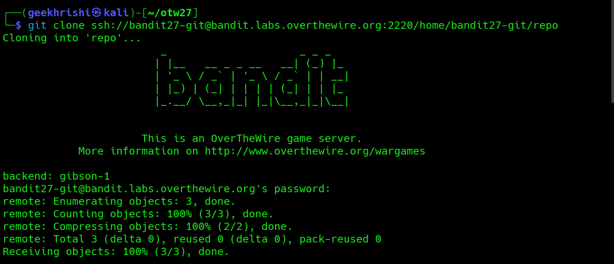

# Bandit Level 27 → Level 28

**Concept:** Git Repository Cloning and Inspection

**Difficulty:** Trivial

## What the level asks

A Git repository is hosted on the OverTheWire infrastructure and accessible through SSH. The objective is to clone the repository locally and inspect its contents to locate the password for the next Bandit level.

## Approach

The challenge provided the repository location and specified that it should be accessed from a local machine using Git. After creating a local working directory, the repository was cloned over SSH using the credentials associated with the Bandit27 account.

Once the repository was downloaded, its contents were inspected. The repository contained a README file, which was reviewed to determine whether it contained information relevant to the challenge. The password for the next level was stored directly within the repository content and could be retrieved by reading the file.

## Solution

```bash
mkdir ~/otw27

cd ~/otw27

git clone ssh://bandit27-git@bandit.labs.overthewire.org:2220/home/bandit27-git/repo

cd repo

cat README

# Password obtained:
# [REDACTED]
```

### Screenshot



**Caption:** Cloning the Git repository and inspecting its contents.

**Explanation:** The screenshot shows successful cloning of the repository, navigation into the project directory, and retrieval of the password stored within the README file.

## Real-World Relevance

Git repositories are frequently used to store source code, configuration files, deployment scripts, and operational documentation. Security professionals regularly inspect repositories during security assessments to identify exposed credentials, sensitive information, and development artifacts that may provide insight into system configuration or application behavior.
