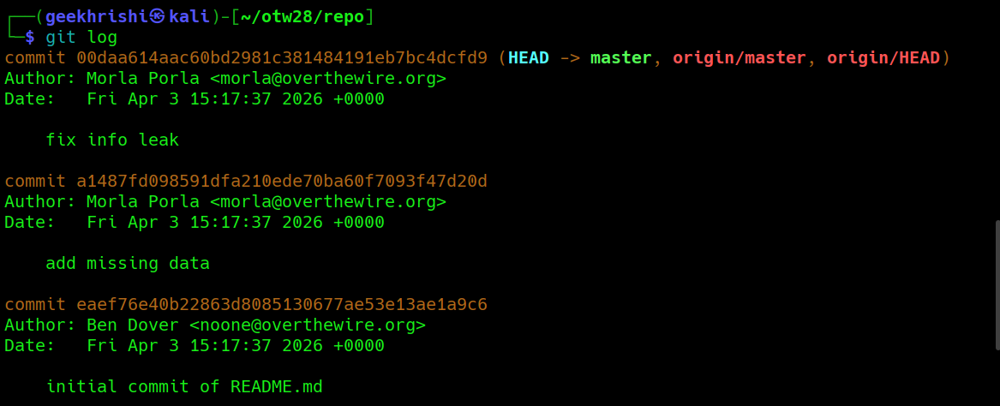

# Bandit Level 28 → Level 29

**Concept:** Git Commit History Analysis

**Difficulty:** Trivial

## What the level asks

A Git repository is provided through SSH. The objective is to examine the repository and identify information that has been removed from the current version but remains available within the commit history.

## Approach

After cloning the repository, the contents of the current branch were inspected. The README file referenced credentials, but the password value had been replaced.

Because Git preserves historical revisions, the commit history was examined using Git's logging functionality. The commit messages revealed previous modifications to the repository, including a commit intended to remove sensitive information.

The repository was checked out at an earlier commit, allowing inspection of the file before the credential was removed. Reviewing the previous version of the README revealed the password for the next level.

## Solution

```bash
git clone ssh://bandit28-git@bandit.labs.overthewire.org:2220/home/bandit28-git/repo

cd repo

cat README.md

git log

git checkout a1487fd098591dfa210ede70ba60f7093f47d20d

cat README.md

# Password obtained:
# [REDACTED]
```

### Screenshot



**Caption:** Reviewing repository history to recover previously removed information.

**Explanation:** The screenshot shows examination of the commit history, checkout of an earlier revision, and retrieval of the password from a previous version of the README file.

## Real-World Relevance

Sensitive information is often removed from repositories after accidental exposure, but Git preserves historical revisions by design. Security assessments frequently include commit history analysis because credentials, API keys, tokens, and configuration data may remain accessible even after they have been deleted from the current version of a project.
