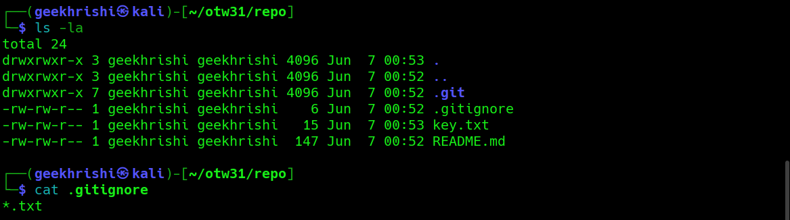
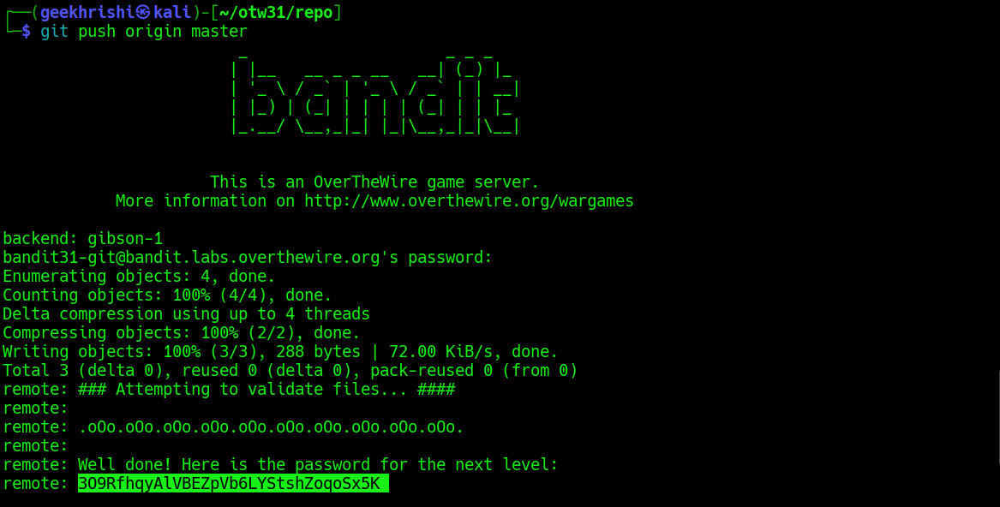

# Bandit Level 31 → Level 32

**Concept:** Git Repository Modification and Remote Submission

**Difficulty:** Non-trivial

## What the level asks

A Git repository contains instructions requiring a specific file to be added and pushed back to the remote repository. The objective is to satisfy the repository requirements and retrieve the password for the next level.

## Approach

After cloning the repository, the README file was inspected to determine the required action. The instructions specified that a file named `key.txt` containing a specific phrase should be committed and pushed to the master branch.

A file matching the required content was created locally. However, inspection of the repository revealed a `.gitignore` rule configured to ignore all `.txt` files, preventing the required file from being tracked by Git.

The ignore rule was reviewed and removed so that the file could be added to version control. After staging the changes, a commit was created and pushed to the remote repository. The remote validation process verified the submission and returned the password for the next level.

## Solution

```bash
git clone ssh://bandit31-git@bandit.labs.overthewire.org:2220/home/bandit31-git/repo

cd repo

cat README.md

nano key.txt

cat .gitignore

rm .gitignore

git add .

git commit -m "Added key.txt"

git push origin master

# Password obtained:
# [REDACTED]
```

### Screenshot



**Caption:** Identifying the repository rule preventing the required file from being tracked.

**Explanation:** The screenshot shows inspection of the repository instructions, creation of the required file, and analysis of the `.gitignore` configuration that prevented `.txt` files from being committed.

### Screenshot



**Caption:** Submitting the required repository changes for automated validation.

**Explanation:** The screenshot demonstrates staging and committing the required changes, pushing them to the remote repository, and receiving successful validation along with the password for the next level.

## Real-World Relevance

Modern software development relies heavily on Git-based workflows involving commits, pushes, validation pipelines, and automated checks. Security professionals frequently review repository configurations, ignore rules, and CI/CD processes because these mechanisms directly influence how code and sensitive files are managed throughout the software development lifecycle.
