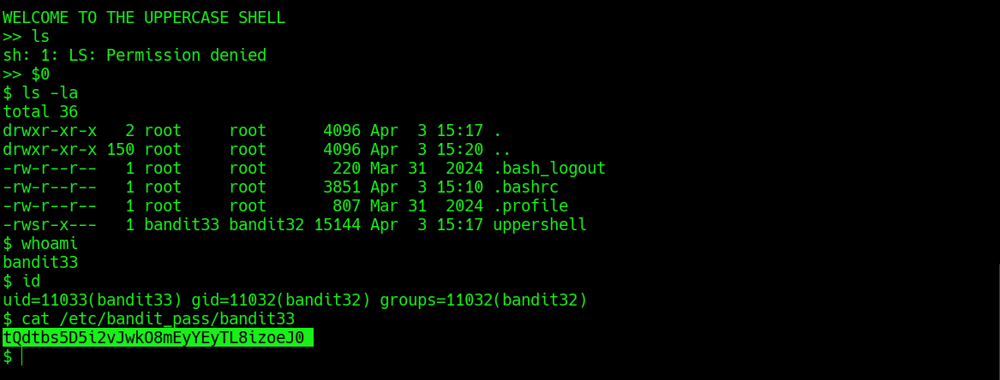

# Bandit Level 32 → Level 33

**Concept:** Restricted Shell Escape via Variable Expansion

**Difficulty:** Non-trivial

## What the level asks

The Bandit32 account provides access to a highly restricted shell that automatically converts user input to uppercase. The objective is to bypass the restriction and obtain access to a normal shell environment.

## Approach

After authentication, the environment presented an "UPPERCASE SHELL" that transformed commands into uppercase before execution. Because Linux commands are case-sensitive, standard commands such as `ls` could not be executed successfully.

Instead of attempting to execute commands directly, shell variables were considered. The special variable `$0` references the currently executing shell. Variable expansion occurs before command interpretation, allowing the original shell process to be invoked without being affected by the uppercase conversion logic.

Executing `$0` launched a standard shell environment. Once unrestricted shell access was obtained, normal system commands were used to verify the user context and read the password file for the next level.

## Solution

```bash
ls

$0

whoami

id

cat /etc/bandit_pass/bandit33

# Password obtained:
# [REDACTED]
```

### Screenshot



**Caption:** Escaping the uppercase-restricted shell and obtaining normal command execution.

**Explanation:** The screenshot shows failure of standard commands within the restricted environment, successful shell escape through variable expansion, verification of the resulting user context, and retrieval of the password for the next level.

## Real-World Relevance

Restricted shells are often implemented to limit user actions in controlled environments. Security professionals evaluate such controls to determine whether alternative execution paths, environment variables, interpreters, or shell features can bypass intended restrictions. Understanding shell behavior and variable expansion is valuable when assessing the effectiveness of access-control mechanisms and hardened execution environments.
