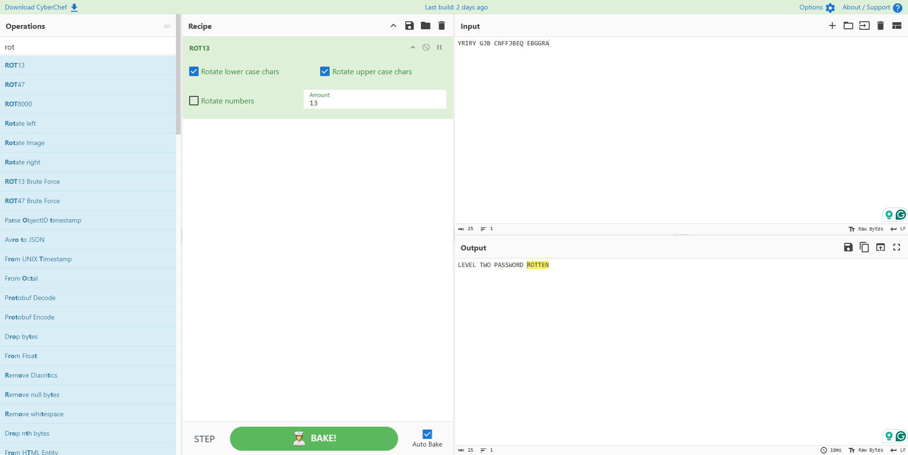

# Krypton Level 1 → 2

**Concept:** ROT13 Cipher
**Difficulty:** Trivial
**Tools Used:** tr, CyberChef

---

## What the level gives you

Inside the `krypton2` file, the password is stored using a ROT13 transformation.

The README explains that the ciphertext preserves word boundaries instead of grouping letters into standard five-character blocks.

The encrypted text is:

```text
YRIRY GJB CNFFJBEQ EBGGRA
```

## Cipher explanation

ROT13 is a Caesar cipher that rotates every letter by 13 positions in the alphabet.

Because the English alphabet contains 26 letters, applying ROT13 twice returns the original plaintext. This makes ROT13 a reversible transformation rather than secure encryption.

For example:

```text
A ↔ N
B ↔ O
C ↔ P
```

Applying the transformation twice restores the original text.

## Solution

```bash
# Read the ciphertext
cat krypton2

# Apply ROT13 using tr
cat krypton2 | tr 'A-Za-z' 'N-ZA-Mn-za-m'

# Output:
# LEVEL TWO PASSWORD ROTTEN
```

## Screenshot

The ciphertext was decoded using CyberChef's ROT13 operation.



## Real-world relevance

ROT13 occasionally appears in malware samples, scripts, challenge environments, and archived forum content as a lightweight obfuscation method. Security analysts regularly encounter simple character-shift transformations when inspecting encoded strings or hidden command-and-control indicators.