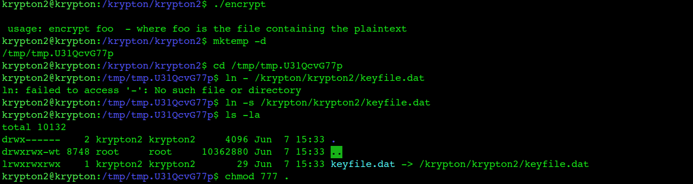
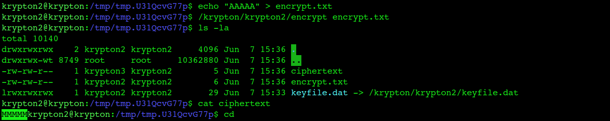
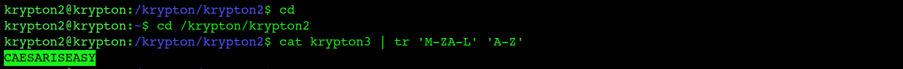

# Krypton Level 2 → 3

**Concept:** Caesar Cipher Cryptanalysis Using an Encryption Oracle
**Difficulty:** Easy
**Tools Used:** encrypt binary, symbolic links, tr

---

## What the level gives you

The level introduces a classical Caesar cipher.

The password for Level 3 is stored in the `krypton3` file and encrypted using an unknown Caesar shift.

Direct access to the encryption key is not provided. Instead, a setuid encryption program named `encrypt` is available. The program uses the same key that encrypted the target password.

This creates an encryption oracle that can be queried with chosen plaintext.

---

## Cipher theory

A Caesar cipher is a monoalphabetic substitution cipher where each plaintext letter is shifted by a fixed number of positions in the alphabet.

For example, with a shift of 3:

```text
A → D
B → E
C → F
```

The key weakness of a Caesar cipher is that every character is transformed using the same shift value. Once the shift is recovered, every ciphertext encrypted with that key can be decrypted immediately.

This level provides access to an encryption oracle. By encrypting a known plaintext, the shift can be determined directly and used to reverse the encryption applied to the target ciphertext.

---

## Cryptanalysis approach

I first examined the README and noticed that direct access to the key was unavailable.

However, the challenge provided an encryption program that used the same secret key as the ciphertext protecting the Level 3 password.

To determine the shift value, I created a temporary working directory and linked the provided keyfile into that directory.

I then encrypted a known plaintext consisting entirely of the letter `A`:

```text
AAAAA
```

The encryption output was:

```text
MMMMM
```

Since every `A` became `M`, the cipher shift was immediately revealed.

With the shift identified, I could reverse the transformation and decrypt the contents of the `krypton3` file.

This recovered the Level 3 password.

---

## Solution

```bash
# Create temporary workspace
mktemp -d

# Move into workspace
cd /tmp/tmp.XXXXXX

# Link required keyfile
ln -s /krypton/krypton2/keyfile.dat

# Allow krypton3 access
chmod 777 .

# Create known plaintext
echo "AAAAA" > encrypt.txt

# Encrypt known plaintext
/krypton/krypton2/encrypt encrypt.txt

# View resulting ciphertext
cat ciphertext

# Output:
# MMMMM
```

Since:

```text
A → M
```

the cipher uses a shift of 12.

Decrypt the Level 3 ciphertext:

```bash
cat krypton3 | tr 'M-ZA-L' 'A-Z'

# Output:
# CAESARISEASY
```

---

## Screenshot

### Oracle Setup



### Shift Recovery



### Password Recovery



---

## Real-world relevance

This challenge demonstrates a chosen-plaintext attack against an encryption oracle. Similar weaknesses have appeared throughout cryptographic history whenever attackers can submit controlled input and observe encrypted output.

The same principle underlies many practical cryptographic attacks against poorly designed encryption systems, insecure protocols, and custom application-level cryptography. Recovering encryption behavior through oracle access is a foundational concept in cryptanalysis and security research.

## What I'd do differently

Instead of testing multiple plaintext values, a single repeated character was sufficient to recover the entire Caesar shift immediately. Using a known plaintext drastically reduced the effort required to break the cipher.