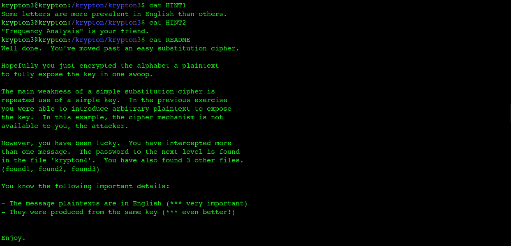
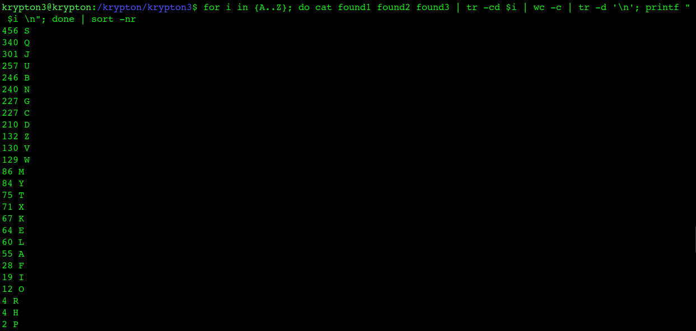
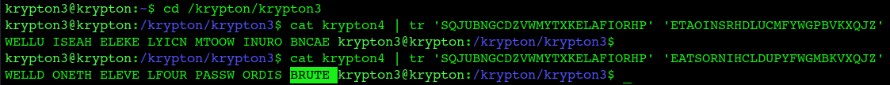

# Krypton Level 3 → 4

**Concept:** Monoalphabetic Substitution Cipher
**Difficulty:** Medium
**Tools Used:** Frequency Analysis, tr, bash

---

## What the level gives you

This level moves beyond simple Caesar ciphers and introduces a general monoalphabetic substitution cipher.

The password for the next level is stored in the file `krypton4`. In addition, three intercepted ciphertexts (`found1`, `found2`, and `found3`) are provided.

The challenge gives two important pieces of information:

- The plaintext messages are written in American English.
- All ciphertexts were encrypted using the same substitution key.

Hints provided by the level explicitly suggest using frequency analysis.

---

## Cipher theory

A monoalphabetic substitution cipher replaces each plaintext letter with a corresponding ciphertext letter according to a fixed substitution alphabet.

For example:

```text
Plain : ABCDEFGHIJKLMNOPQRSTUVWXYZ
Cipher: QWERTYUIOPASDFGHJKLZXCVBNM
```

Every occurrence of a plaintext letter always maps to the same ciphertext letter.

The primary weakness of this cipher is that letter frequencies are preserved. Common English letters such as E, T, A, O, I, and N appear more frequently than others, and these statistical patterns survive encryption.

Frequency analysis exploits this weakness by comparing ciphertext letter distributions against known English language distributions.

---

## Cryptanalysis approach

I began by reading the hints and challenge description. The level emphasized that all intercepted messages were written in English and encrypted using the same substitution alphabet.

Instead of attacking the password directly, I combined the intercepted messages and performed frequency analysis across all available ciphertext.

```bash
cat found1 found2 found3
```

I then counted the occurrence of each ciphertext character and sorted the results by frequency.

The most common ciphertext characters were compared against the most common letters in English:

```text
ETAOIN SHRDLU
```

Using this information, I gradually reconstructed the substitution alphabet.

As additional mappings were identified, recognizable English words began appearing within the decrypted text. Refining the mapping eventually revealed the complete substitution key.

Once the substitution alphabet was recovered, decrypting the contents of `krypton4` immediately revealed the next password.

---

## Solution

```bash
# Count frequency of ciphertext characters
for i in {A..Z}; do
    cat found1 found2 found3 |
    tr -cd $i |
    wc -c |
    tr -d '\n'
    printf " $i\n"
done | sort -nr
```

Recovered substitution mapping:

```text
SQJUBNGCDZVWMYTXKELAFIORHP
↓
ETAOINSRHDLUCMFYWGPBVKXQJZ
```

Decrypt the target ciphertext:

```bash
cat krypton4 | \
tr 'SQJUBNGCDZVWMYTXKELAFIORHP' \
   'ETAOINSRHDLUCMFYWGPBVKXQJZ'
```

Output:

```text
WELLDONETHELEVELFOURPASSWORDISBRUTE
```

Password:

```text
BRUTE
```

---

## Screenshot

### Challenge Hints



### Frequency Analysis



### Password Recovery



---

## Real-world relevance

Frequency analysis is one of the earliest and most important techniques in cryptanalysis. Although modern encryption algorithms are resistant to this attack, analysts still use statistical pattern analysis when investigating malware, encoded command-and-control traffic, proprietary encoding schemes, and legacy cryptographic systems.

Understanding why frequency analysis works helps explain why modern cryptography attempts to eliminate predictable statistical patterns.

---

## What I'd do differently

If solving this manually again, I would use a dedicated substitution-cipher analysis tool after obtaining the initial frequency counts. This would accelerate reconstruction of the substitution alphabet while still preserving the learning objectives of the challenge.