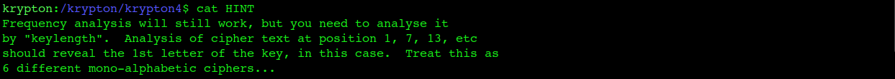
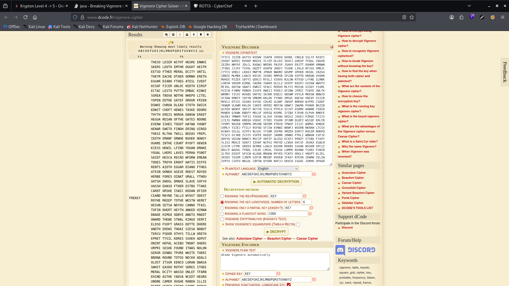
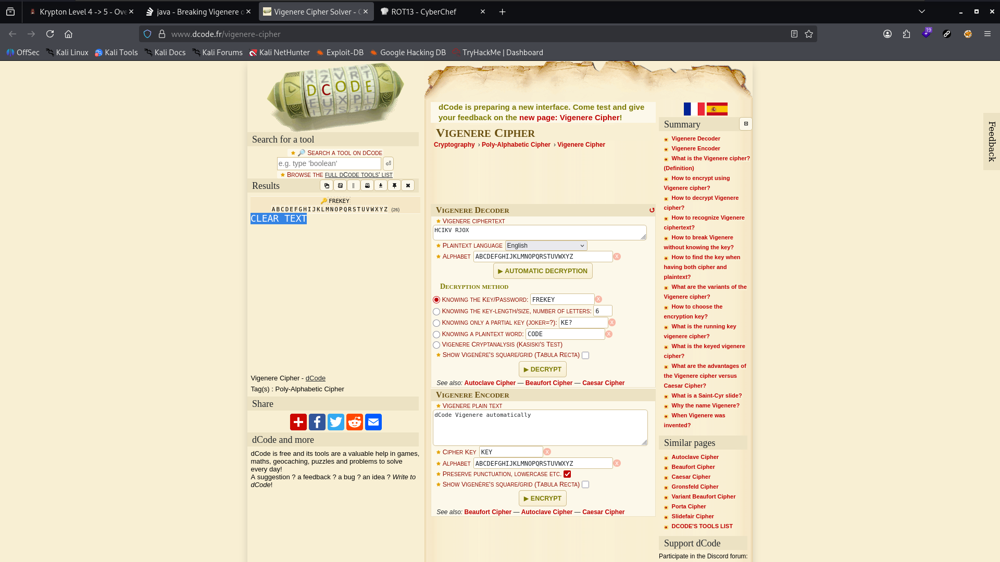

# Krypton Level 4 → 5

**Concept:** Vigenère Cipher
**Difficulty:** Medium
**Tools Used:** Frequency Analysis, Vigenère Cryptanalysis, dCode

---

## What the level gives you

This level introduces the Vigenère cipher, one of the most well-known polyalphabetic substitution ciphers.

Unlike previous levels, a plaintext letter may encrypt to different ciphertext letters depending on its position and the key.

The challenge provides:

- Two intercepted English-language ciphertexts
- The ciphertext containing the password
- The key length

A hint reveals that the encryption key contains exactly six characters.

---

## Cipher theory

The Vigenère cipher uses a repeating keyword to determine the shift applied to each plaintext character.

Unlike a Caesar cipher, which uses a single shift value, a Vigenère cipher uses multiple Caesar shifts determined by the key.

Example:

```text
Plaintext : PROCEEDMEETINGASAGREED
Key       : GOLDGOLDGOLDGOLDGOLDGO
Ciphertext: VFZFKSOPKSELTULVGUCHKR
```

Because multiple alphabets are used, simple frequency analysis against the entire ciphertext becomes ineffective.

However, if the key length is known, the ciphertext can be divided into groups corresponding to each key position. Each group effectively becomes an independent Caesar cipher that can be analyzed separately.

---

## Cryptanalysis approach

The challenge provided the key length directly:

```text
6
```

Knowing the key length eliminates the most difficult step of classical Vigenère cryptanalysis.

I treated every sixth character as belonging to the same substitution stream:

```text
Position 1, 7, 13, ...
Position 2, 8, 14, ...
Position 3, 9, 15, ...
```

Each stream was then analyzed independently using frequency analysis.

After recovering the six individual shifts, the full Vigenère key was identified as:

```text
FREKEY
```

Using the recovered key, I decrypted the ciphertext stored in `krypton5`.

The resulting plaintext revealed the Level 5 password.

---

## Solution

Ciphertext:

```bash
cat krypton5
```

Output:

```text
HCIKV RJOX
```

Recovered key:

```text
FREKEY
```

Using a Vigenère decoder with the recovered key:

```text
Ciphertext : HCIKV RJOX
Key        : FREKEY
Plaintext  : CLEARTEXT
```

Password:

```text
CLEARTEXT
```

---

## Screenshot

### Key Length Hint



### Vigenère Analysis



### Password Recovery



---

## Real-world relevance

The Vigenère cipher was historically considered highly secure because it defeated simple frequency analysis. Its eventual defeat through techniques such as Kasiski examination and Index of Coincidence marked a major milestone in the development of modern cryptanalysis.

The analytical principles used against Vigenère still appear in modern threat intelligence, malware analysis, traffic analysis, and cryptographic research whenever repeated patterns leak information about an underlying secret.

---

## What I'd do differently

If the key length had not been provided, I would first use Kasiski Examination or Index of Coincidence analysis to determine the most likely key length before attempting frequency analysis on individual character streams.