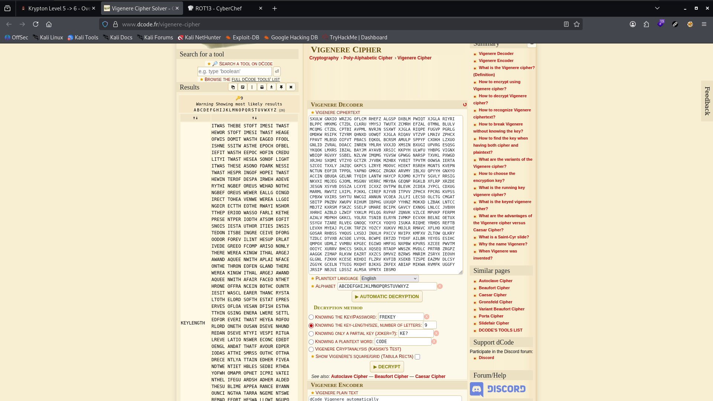

# Krypton Level 5 → 6

**Concept:** Vigenère Cipher with Unknown Key Length
**Difficulty:** Hard
**Tools Used:** Frequency Analysis, Vigenère Cryptanalysis, dCode

---

## What the level gives you

This level builds upon the previous Vigenère cipher challenge.

Unlike Level 4, the key length is no longer provided. Instead, multiple intercepted ciphertexts are available, and the challenge notes that the plaintext messages are written in American English.

The objective is to recover both the Vigenère key and the password stored in the `krypton6` file.

A hint advises against attempting the challenge manually, suggesting that automated cryptanalysis techniques are more appropriate.

---

## Cipher theory

The Vigenère cipher is a polyalphabetic substitution cipher that encrypts plaintext using a repeating keyword.

Each character of the key determines the Caesar shift applied to the corresponding plaintext character.

For example:

```text
Plaintext : ATTACKATDAWN
Key       : SECRETSECRET
Ciphertext: SXVRGDSXHCEG
```

Unlike a monoalphabetic substitution cipher, the same plaintext letter may encrypt to different ciphertext letters depending on its position within the message.

When the key length is known, the ciphertext can be separated into independent Caesar cipher streams and solved individually. However, when the key length is unknown, an additional cryptanalysis step is required to determine the most likely key size before frequency analysis can be performed.

---

## Cryptanalysis approach

The challenge provided several ciphertext samples encrypted with the same Vigenère key.

Since the key length was unknown, the first objective was to determine the most likely key size.

Using Vigenère cryptanalysis techniques, I tested different key lengths and examined the resulting frequency distributions. Once the correct key length was identified, each character position could be treated as an independent Caesar cipher.

Frequency analysis on each stream gradually revealed the key.

The recovered key was:

```text
KEYLENGTH
```

With the key recovered, decrypting the ciphertext contained in `krypton6` revealed the password for the next level.

---

## Solution

Ciphertext samples:

```bash
cat found1
cat found2
cat found3
```

Using Vigenère cryptanalysis, the following key was recovered:

```text
KEYLENGTH
```

Decrypt the target ciphertext:

```bash
cat krypton6
```

Output:

```text
BELOSZ
```

Password:

```text
RANDOM
```

---

## Screenshot

### Vigenère Cryptanalysis



### Password Recovery


---

## Real-world relevance

Historically, the Vigenère cipher was considered highly secure because it defeats simple frequency analysis. The eventual development of methods such as Kasiski Examination and Index of Coincidence demonstrated that even polyalphabetic ciphers leak statistical information when sufficient ciphertext is available.

The same analytical mindset remains relevant in modern cybersecurity. Threat intelligence analysts, malware researchers, and cryptographers frequently examine repeated patterns, correlations, and statistical anomalies to recover hidden information from encrypted or obfuscated data.

---

## What I'd do differently

If solving this challenge without automated tools, I would first perform a formal Kasiski Examination to estimate the key length before applying frequency analysis to individual character streams. However, automated Vigenère analysis dramatically reduces the time required to recover both the key length and the encryption key.