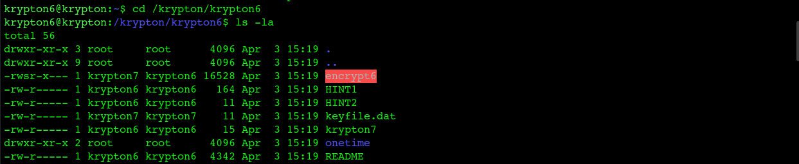
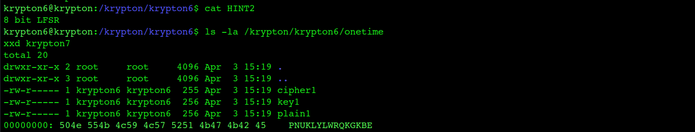
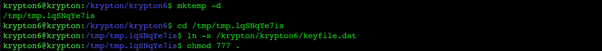
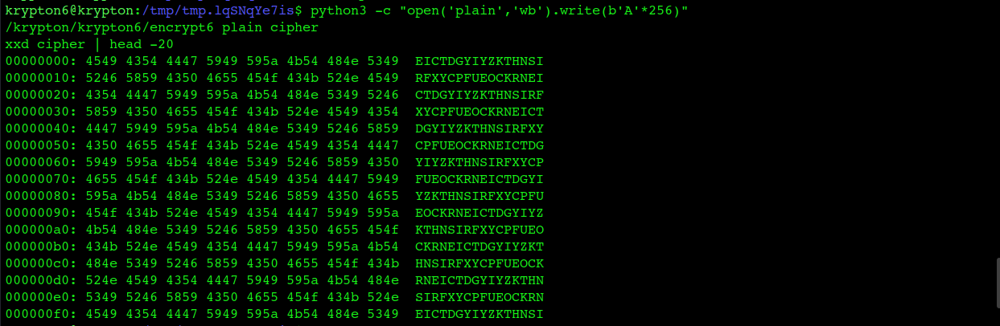
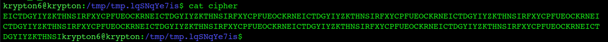
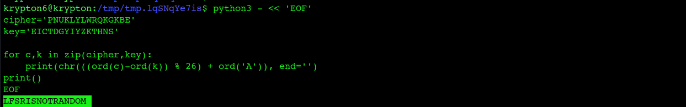

# Krypton Level 6 → 7

**Concept:** Stream Cipher Cryptanalysis (Known Plaintext Attack)
**Difficulty:** Hard
**Tools Used:** xxd, Python, Known Plaintext Attack

---

## What the level gives you

This final Krypton challenge moves away from classical substitution ciphers and introduces stream ciphers.

The challenge provides:

* An encryption binary (`encrypt6`)
* A protected keyfile
* Example plaintext, key, and ciphertext files
* Two hints
* An encrypted password stored in `krypton7`

The README explains the concept of One-Time Pads, stream ciphers, and pseudo-random keystream generation. It also hints that the random number generator used by the encryption service is weak.

The goal is to recover the plaintext contained within `krypton7`.

---

## Cipher theory

A stream cipher encrypts data one byte at a time using a generated keystream.

Conceptually:

```text
Ciphertext = Plaintext ⊕ Keystream
```

In a secure stream cipher, the keystream should be unpredictable and never reveal patterns.

The challenge hints reveal that the keystream is generated using an **8-bit Linear Feedback Shift Register (LFSR)**.

Because an 8-bit LFSR has a very small internal state, its output eventually repeats. Once that repetition becomes visible, the generated keystream can be predicted and used to recover encrypted messages.

---

## Cryptanalysis approach

The challenge hints pointed toward an 8-bit Linear Feedback Shift Register (LFSR).

An 8-bit LFSR has a very small state space and eventually repeats its output. To observe this behavior, I created a temporary working directory and used the encryption oracle to encrypt a large block of identical characters.

```bash
python3 -c "open('plain','w').write('A'*256)"
/krypton/krypton6/encrypt6 plain cipher
```

Examining the resulting ciphertext revealed a repeating pattern:

```text
EICTDGYIYZKTHNSIRFXYCPFUEOCKRN
EICTDGYIYZKTHNSIRFXYCPFUEOCKRN
...
```

The repeated sequence showed that the pseudo-random generator was cycling and producing a predictable keystream.

Because the plaintext consisted entirely of repeated `A` characters, any repeating structure in the ciphertext had to originate from the keystream. The repeating ciphertext revealed that the underlying keystream was repeating, confirming that the weak 8-bit LFSR was cycling through its states.

The first fifteen characters of the repeating ciphertext pattern were:

```text
EICTDGYIYZKTHNS
```

Using this recovered keystream, I decrypted the ciphertext stored in `krypton7` and recovered the password.

---

## Solution

Create a temporary workspace:

```bash
mktemp -d
cd /tmp/tmp.XXXXXX

ln -s /krypton/krypton6/keyfile.dat
chmod 777 .
```

Generate repeated plaintext:

```bash
python3 -c "open('plain','w').write('A'*256)"
```

Encrypt the plaintext:

```bash
/krypton/krypton6/encrypt6 plain cipher
```

Inspect the ciphertext:

```bash
cat cipher
```

Output:

```text
EICTDGYIYZKTHNSIRFXYCPFUEOCKRN
EICTDGYIYZKTHNSIRFXYCPFUEOCKRN
...
```

Recover the first fifteen keystream characters:

```text
EICTDGYIYZKTHNS
```

Decrypt the password:

```python
cipher = "PNUKLYLWRQKGKBE"
key    = "EICTDGYIYZKTHNS"

for c, k in zip(cipher, key):
    print(chr(((ord(c)-ord(k)) % 26) + ord('A')), end='')
```

Output:

```text
LFSRISNOTRANDOM
```

Password:

```text
LFSRISNOTRANDOM
```

---

## Screenshot

### Challenge Enumeration

Shows the contents of the `krypton6` directory, including the encryption binary, keyfile, hints, and encrypted password.



### LFSR Hint and Ciphertext Inspection

Shows the 8-bit LFSR hint and inspection of the encrypted password stored in `krypton7`.



### Environment Preparation

Shows creation of a temporary workspace, keyfile symlink creation, and permission adjustments required for the encryption oracle.



### Repeating Keystream Discovery

Shows encryption of a large block of repeated `A` characters and the resulting repeating ciphertext pattern that exposes the weak LFSR output.



### Keystream Confirmation

Displays the repeating ciphertext directly, making the repeating keystream pattern clearly visible.



### Password Recovery

Shows decryption of the encrypted password using the recovered keystream, resulting in the final password.


---

## Real-world relevance

This challenge demonstrates why stream ciphers depend heavily on the quality of their pseudo-random number generators.

A stream cipher can appear secure, but if the keystream generator repeats or becomes predictable, attackers can recover portions of the keystream and use them to decrypt protected data.

Historically, weaknesses in keystream generation have led to practical attacks against real-world cryptographic systems. Modern cryptography therefore places significant emphasis on entropy sources, secure random number generation, and resistance against keystream prediction.

---

## What I'd do differently

If solving a similar challenge manually, I would automate the detection of repeating sequences and estimate the LFSR cycle length using a Python script. This would make keystream recovery faster and allow analysis of much larger ciphertext samples with minimal effort.
