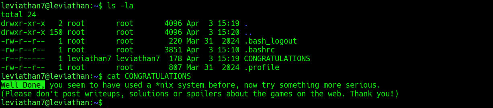

# OverTheWire: Leviathan

Leviathan is a privilege escalation and binary analysis wargame from OverTheWire.

Unlike Bandit, Leviathan provides little to no guidance. The objective is not simply executing the correct command but identifying attack paths through enumeration, binary analysis, and exploitation of misconfigurations.

The challenges focus heavily on Linux privilege escalation techniques, SUID binaries, runtime analysis, credential discovery, symbolic link attacks, and brute-force automation.

**Host:** leviathan.labs.overthewire.org
**Port:** 2223

---

## Completed Levels

| Level | Concept                                            | Tools Used            | Writeup                   |
| ----- | -------------------------------------------------- | --------------------- | ------------------------- |
| 0 → 1 | Hidden directory enumeration, credential discovery | ls, grep              | [writeup](level-00-01.md) |
| 1 → 2 | Binary analysis, hardcoded credentials             | ltrace                | [writeup](level-01-02.md) |
| 2 → 3 | SUID binary abuse, filename manipulation           | ltrace, ln, chmod     | [writeup](level-02-03.md) |
| 3 → 4 | Runtime authentication analysis, strcmp discovery  | ltrace                | [writeup](level-03-04.md) |
| 4 → 5 | Binary/ASCII encoding, credential decoding         | perl, binary analysis | [writeup](level-04-05.md) |
| 5 → 6 | Symlink attack on SUID binary                      | ltrace, ln, touch     | [writeup](level-05-06.md) |
| 6 → 7 | Brute force 4-digit PIN                            | bash loop             | [writeup](level-06-07.md) |

---

## Concepts Covered

### Linux Enumeration

* Hidden file discovery
* Hidden directory discovery
* User-owned artifact analysis
* Credential hunting

### Binary Analysis

* Runtime tracing with `ltrace`
* Authentication flow analysis
* String comparison discovery
* Hardcoded credential identification

### Privilege Escalation

* SUID binary enumeration
* SUID binary abuse
* Privileged file access
* Local privilege escalation methodology

### Exploitation Techniques

* Filename manipulation
* Command construction flaws
* Symbolic link attacks
* Weak authentication bypass
* Local brute-force attacks

### Data Analysis

* Binary-to-ASCII conversion
* Credential extraction from encoded data
* Information disclosure analysis

---

## Tools Used

Throughout the Leviathan wargame, the following tools and techniques were used:

```bash
ls
grep
cat
head
ltrace
ln -s
chmod
touch
perl
bash loops
```

---

## Why Leviathan?

Bandit teaches Linux fundamentals.

Leviathan teaches attacker methodology.

The core skill developed throughout Leviathan is learning how to approach an unfamiliar privileged binary and determine:

* What it does
* How it validates input
* Whether it trusts user-controlled data
* Whether elevated privileges can be abused
* Whether authentication mechanisms can be bypassed

These skills map directly to real-world security assessments.

Examples include:

* SUID/SGID privilege escalation during Linux pentests
* Runtime analysis of unknown executables
* Discovery of hardcoded credentials
* Symlink attacks against privileged processes
* Authentication bypass through weak validation logic
* Brute-force attacks against small credential spaces

---

## Repository Structure

```text
leviathan/
├── README.md
├── level-00-01.md
├── level-01-02.md
├── level-02-03.md
├── level-03-04.md
├── level-04-05.md
├── level-05-06.md
├── level-06-07.md
│
└── assets/
```

---

## Completion Status

* Status: Completed
* Levels Completed: 7/7
* Final Level Reached: Leviathan7

### Completion Proof



---

## Key Takeaways

Leviathan demonstrates that successful privilege escalation often begins with careful enumeration rather than exploitation.

Across the seven levels, the primary lessons were:

* Enumerate everything before attempting exploitation
* Trace program behaviour instead of guessing
* Inspect SUID binaries carefully
* Never trust user-controlled input in privileged programs
* Validate file operations in world-writable directories
* Recognize encoding before assuming encryption
* Small authentication keyspaces are vulnerable to brute force

These concepts frequently appear in Linux privilege escalation assessments, red team engagements, capture-the-flag competitions, and real-world penetration tests.
