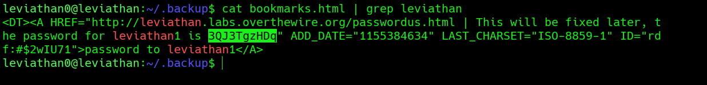

## Leviathan Level 0 → 1

**Concept:** Hidden directory enumeration and credential discovery in user-owned files
**Difficulty:** Easy
**Tools Used:** ls, grep, head, cat

---

### What the level gives you

After logging into the Leviathan server as `leviathan0`, I was placed in a standard-looking home directory. At first glance, only common shell configuration files were visible. No challenge instructions, binaries, or obvious hints were provided.

Since Leviathan offers no guidance about where to start, the first task was to enumerate the environment and identify anything unusual within the home directory.

---

### Enumeration

I began by listing all files, including hidden entries, using `ls -la`. Most of the contents were standard Linux configuration files such as `.bashrc`, `.profile`, and `.bash_logout`. One entry immediately stood out: a hidden directory named `.backup`.

Hidden directories are commonly used to store application data, backups, or configuration information that may not be intended for casual inspection. Because it was the only non-standard item present, I investigated it further.

Inside `.backup`, I discovered a single file named `bookmarks.html`. The filename suggested that it was a browser bookmark export rather than a system file. Viewing the beginning of the file confirmed that it was a Netscape-style bookmark file generated by a web browser.

The file was relatively large, so manually reading it line by line would have been inefficient. Since the next account name was likely to appear somewhere inside the file, I searched the contents for references to "leviathan".

This search revealed an embedded bookmark containing a comment that directly exposed the password for the `leviathan1` account.

---

### Analysis

The challenge was less about exploiting a vulnerability and more about identifying information that had been unintentionally exposed.

When I first entered the system, there were no binaries to analyze and no obvious privilege-escalation paths. The presence of the hidden `.backup` directory was the first indicator that useful information might be stored locally.

Discovering a browser bookmark export was initially unexpected because bookmark files are rarely associated with authentication data. However, exported browser data often contains comments, notes, URLs, and other metadata that users forget to sanitize.

Instead of reading the entire file manually, I searched for the string "leviathan" to quickly locate any references related to the wargame accounts. This approach immediately exposed a bookmark entry containing a note with the password for the next level.

The key insight was recognizing that user-generated files often contain sensitive information and should be examined during enumeration rather than focusing exclusively on executables or system configuration files.

---

### Exploitation

```bash
# Step 1: Log in as leviathan0
ssh leviathan0@leviathan.labs.overthewire.org -p 2223

# Step 2: List all files, including hidden entries
ls -la

# Step 3: Enter the hidden backup directory discovered during enumeration
cd .backup

# Step 4: Verify the contents of the directory
ls -la

# Step 5: Inspect the beginning of the bookmark file
head bookmarks.html

# Step 6: Search the bookmark file for references to leviathan accounts
cat bookmarks.html | grep leviathan

# Output / password captured:
# [REDACTED]
```

---

### Screenshot



---

### Real-world relevance

This level mirrors a common finding during penetration tests where sensitive credentials are discovered inside backup files, exported browser data, documentation, configuration archives, or user-created notes. Attackers frequently search for keywords such as "password", "admin", "login", or account names during post-compromise enumeration.

In real Linux and enterprise environments, exposed credentials are often found in forgotten backup directories, exported browser profiles, developer notes, and legacy configuration files. Thorough enumeration of user-accessible files regularly leads to privilege escalation opportunities without requiring exploitation of software vulnerabilities.

---

### What I'd do differently

After identifying the bookmark file, I initially viewed only the beginning of the document to understand its format. In hindsight, directly searching the file for relevant account names or keywords would have reached the credential disclosure faster.
