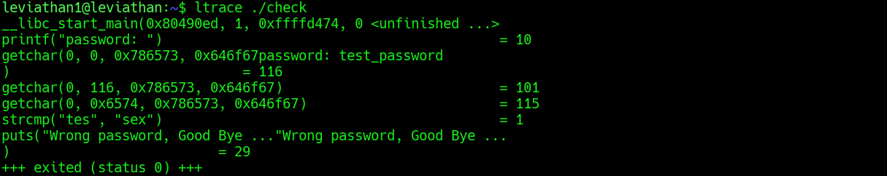

## Leviathan Level 1 → 2

**Concept:** Dynamic binary analysis and hardcoded credential discovery using ltrace
**Difficulty:** Easy
**Tools Used:** ls, ltrace, whoami, cat

---

### What the level gives you

After logging in as `leviathan1`, I found a very small home directory containing mostly standard shell configuration files. One file immediately stood out: a binary named `check`.

The binary had the SUID bit set and was owned by `leviathan2`, indicating that it executed with the privileges of the next user. Since no instructions were provided, understanding the behaviour of this binary became the primary objective.

---

### Enumeration

I started by listing the contents of the home directory using `ls -la`. Most files were standard Linux user configuration files and did not appear relevant to the challenge. The only unusual item was the executable named `check`.

Examining its permissions revealed that it was SUID-enabled and owned by `leviathan2`. This immediately suggested that successful interaction with the binary could potentially grant access to resources belonging to the next level.

Running the program normally presented a password prompt. Entering a test value resulted in an authentication failure message and immediate termination. At this point, I needed to determine how the binary validated user input.

Because the binary appeared to perform a password comparison, I chose to inspect its runtime behaviour using `ltrace`, which traces calls to dynamically linked library functions.

---

### Analysis

When I executed the program through `ltrace`, I observed the binary reading characters from standard input and eventually passing my input into a function named `strcmp()`.

The critical observation was the following comparison:

```text
strcmp("tes", "sex")
```

The first value represented the beginning of my supplied input, while the second value represented the string embedded inside the binary. Since `strcmp()` compares two strings and returns zero only when they match exactly, the trace effectively revealed the expected password.

This was the turning point of the challenge. Instead of attempting to guess credentials or reverse engineer the executable statically, I was able to observe the authentication process directly while it was running.

After supplying the discovered password to the binary, the program spawned a shell running with the privileges of `leviathan2`.

Verifying my identity with `whoami` confirmed that the privilege transition had succeeded, allowing access to the next level's password file.

---

### Exploitation

```bash id="93s2mz"
# Step 1: Log in as leviathan1
ssh leviathan1@leviathan.labs.overthewire.org -p 2223

# Step 2: Enumerate files and identify interesting binaries
ls -la

# Step 3: Execute the binary normally to understand its behaviour
./check

# Step 4: Trace library calls to observe the authentication logic
ltrace ./check

# Step 5: Enter a sample password and observe the strcmp() comparison
# The trace reveals the hardcoded credential used by the binary

# Step 6: Run the binary again and provide the discovered password
./check

# Step 7: Verify that a privileged shell was spawned
whoami

# Step 8: Read the next level password
cat /etc/leviathan_pass/leviathan2

# Output / password captured:
# [REDACTED]
```

---

### Screenshot



---

### Real-world relevance

Hardcoded credentials remain a common issue in internally developed software, embedded devices, administrative utilities, and legacy enterprise applications. During penetration tests, analysts frequently use dynamic analysis tools such as `ltrace`, `strace`, or debuggers to observe how authentication checks are performed.

This challenge demonstrates how an attacker can recover secrets without modifying the binary itself. Instead of brute forcing authentication, observing runtime behaviour may expose credentials, API keys, or authentication tokens directly from program execution flow.

---

### What I'd do differently

I initially tested the binary manually before tracing it. Given the presence of an unknown SUID executable performing authentication, I would now move directly to dynamic analysis tools such as `ltrace` or `strings` to understand the validation logic more quickly.
