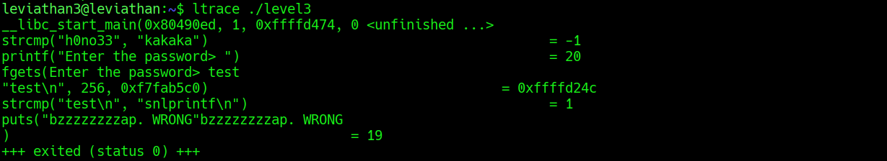

## Leviathan Level 3 → 4

**Concept:** Dynamic binary analysis and authentication bypass through runtime string comparison discovery
**Difficulty:** Easy
**Tools Used:** ls, ltrace, whoami, cat

---

### What the level gives you

After logging in as `leviathan3`, I found a SUID binary named `level3` in the home directory. No documentation or instructions were provided regarding its purpose.

Executing the binary displayed a password prompt, indicating that some form of authentication was required before access to the next level could be obtained.

---

### Enumeration

I began by listing the contents of the home directory to identify any unusual files. Aside from the standard shell configuration files, the only noteworthy item was the executable `level3`.

The binary had the SUID bit set and was owned by `leviathan4`, making it an immediate target for investigation. Since SUID programs execute with the permissions of their owner, successfully passing the authentication check could potentially grant access to resources owned by `leviathan4`.

Running the program normally resulted in a password prompt. Entering a random value produced an error message and terminated the program.

At this point, rather than attempting to guess credentials, I decided to observe the program's internal behaviour using `ltrace`.

---

### Analysis

The `ltrace` output immediately revealed the program's authentication mechanism.

Before accepting user input, the binary performed a string comparison:

```text
strcmp("h0no33", "kakaka")
```

This comparison appeared unrelated to the password prompt and suggested that the binary contained hardcoded strings internally.

More importantly, after entering a test password, I observed another comparison:

```text
strcmp("test\n", "snlprintf\n")
```

This was the key observation. The second argument supplied to `strcmp()` represented the value that the program expected from the user.

Since `strcmp()` returns zero only when both strings are identical, the trace effectively disclosed the correct password without requiring reverse engineering or brute force.

After supplying the discovered value to the binary, the authentication check succeeded and the program spawned a shell running with the privileges of `leviathan4`.

Verifying the active user with `whoami` confirmed that the privilege escalation had succeeded.

---

### Exploitation

```bash
# Step 1: Log in as leviathan3
ssh leviathan3@leviathan.labs.overthewire.org -p 2223

# Step 2: Enumerate files and identify the SUID binary
ls -la

# Step 3: Execute the binary normally to understand its behaviour
./level3

# Step 4: Trace the binary to observe its authentication logic
ltrace ./level3

# Step 5: Enter a test password and observe the strcmp() comparison
# The trace reveals the password expected by the program

# Step 6: Run the binary again using the discovered password
./level3

# Step 7: Confirm the privileged shell
whoami

# Step 8: Read the next level password
cat /etc/leviathan_pass/leviathan4

# Output / password captured:
# [REDACTED]
```

---

### Screenshot



---

### Real-world relevance

This challenge demonstrates how dynamic analysis can expose authentication secrets embedded within application logic. During security assessments, analysts frequently use tools such as `ltrace`, `strace`, and debuggers to observe how credentials are validated at runtime.

Hardcoded passwords, API keys, administrative backdoors, and hidden authentication mechanisms remain common findings in internally developed applications and legacy software. Runtime tracing often reveals these secrets far more quickly than source code review or brute-force testing.

---

### What I'd do differently

Given the presence of a SUID binary that immediately requested a password, I would now treat runtime tracing as the first investigation step. Dynamic analysis provided the answer almost immediately and avoided unnecessary password guessing.
