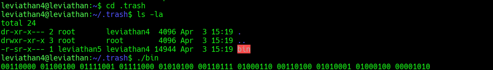
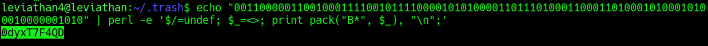

## Leviathan Level 4 → 5

**Concept:** Binary-to-ASCII decoding and information extraction from a SUID binary
**Difficulty:** Easy
**Tools Used:** ls, cd, perl, echo

---

### What the level gives you

After logging in as `leviathan4`, the home directory appeared mostly empty except for a hidden directory named `.trash`.

Inside `.trash`, I discovered a SUID binary named `bin`. Unlike previous levels, the program did not request a password and instead produced a sequence of binary digits when executed.

Because the output was not immediately human-readable, the challenge became one of interpreting and decoding the data correctly.

---

### Enumeration

I started by listing the contents of the home directory and immediately noticed the hidden `.trash` directory. Since Leviathan challenges frequently hide useful artifacts in non-obvious locations, this directory became my first investigation target.

Inside `.trash`, I found a single executable named `bin`. The binary was SUID-enabled and owned by `leviathan5`, indicating that it was intended to be the path toward the next level.

Running the executable did not produce a shell, password prompt, or obvious credential. Instead, it printed a series of binary values grouped into eight-bit chunks.

The output resembled ASCII character encoding rather than encrypted data or machine instructions. Because each group consisted of eight bits, I suspected the binary was printing text encoded in binary form.

This hypothesis led me to attempt binary-to-ASCII conversion.

---

### Analysis

The key observation was that the output contained groups of eight binary digits separated by spaces.

Eight-bit groupings are commonly used to represent ASCII characters. For example:

```text id="8k7ht0"
01000001 = A
01000010 = B
01000011 = C
```

This suggested that the binary output was not intended to be executed or reverse engineered further. Instead, it simply required decoding.

My first attempt used a binary-to-ASCII conversion website to validate the hypothesis. The resulting output produced a readable string, confirming that the binary data represented text.

To avoid relying on external tools, I then performed the conversion directly from the command line using Perl's `pack("B*")` functionality, which converts binary strings into their ASCII representation.

The decoded value produced the credential required for the next level.

The important lesson from this challenge was recognizing encoding rather than assuming exploitation was necessary. Not every security challenge requires abusing a vulnerability; sometimes the objective is correctly interpreting the information presented.

---

### Exploitation

```bash id="rnk1cb"
# Step 1: Log in as leviathan4
ssh leviathan4@leviathan.labs.overthewire.org -p 2223

# Step 2: Enumerate the home directory
ls -la

# Step 3: Enter the hidden directory
cd .trash

# Step 4: List contents and identify the SUID binary
ls -la

# Step 5: Execute the binary and capture its output
./bin

# Step 6: Convert the binary string into ASCII text
echo "0011000001100100011110010111100001010100001101110100011001000100" \
| perl -e '$/=undef; $_=<>; print pack("B*", $_), "\n";'

# Output / password captured:
# [REDACTED]
```

---

### Screenshot





---

### Real-world relevance

Security professionals regularly encounter encoded data during investigations, malware analysis, incident response, and penetration testing. Credentials, configuration values, command-and-control instructions, and exfiltrated data are often stored in encoded formats rather than plain text.

Recognizing common encodings such as Base64, hexadecimal, binary, URL encoding, and ASCII representations allows analysts to quickly extract useful intelligence without wasting time treating encoded data as encrypted data. Distinguishing encoding from encryption is a fundamental skill in both offensive and defensive security work.

---

### What I'd do differently

I initially verified the output using an online binary-to-ASCII converter. In a real assessment, I would move directly to local tooling such as Perl, Python, or CyberChef to avoid relying on external services and to maintain a reproducible workflow.
