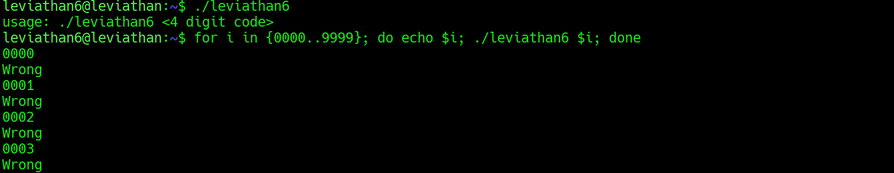
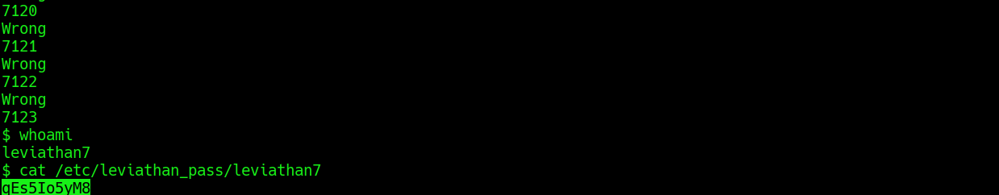

## Leviathan Level 6 → 7

**Concept:** Local brute-force attack against a weak 4-digit authentication mechanism
**Difficulty:** Medium
**Tools Used:** ls, bash, for loop, whoami, cat

---

### What the level gives you

After logging in as `leviathan6`, I found a SUID binary named `leviathan6` in the home directory.

Unlike previous levels, the program did not immediately request a password. Instead, executing it without arguments displayed a usage message indicating that it expected a four-digit code as input.

Because the binary executed with the privileges of `leviathan7`, discovering the correct code became the objective.

---

### Enumeration

I started by listing the contents of the home directory and identifying the SUID executable `leviathan6`.

Running the binary without parameters revealed:

```text
usage: ./leviathan6 <4 digit code>
```

This immediately provided useful information about the authentication mechanism. The program was not expecting an arbitrary password but specifically a four-digit numeric value.

A four-digit code has a maximum search space of:

```text
0000 - 9999
```

which represents only 10,000 possible combinations.

Since this was a local executable rather than a remote service, there was no visible rate limiting, lockout mechanism, delay, or account protection. This made brute forcing the entire keyspace a practical approach.

---

### Analysis

My first thought was to determine whether the binary contained a hidden credential that could be extracted through static or dynamic analysis.

However, the usage message revealed a critical constraint: the expected input was only four digits long.

A search space of 10,000 combinations is extremely small by modern standards. Even a simple shell loop can test every possibility in seconds.

Rather than spending time reverse engineering the executable, I chose the most direct approach and automated the process using a Bash loop.

The loop supplied every value from `0000` through `9999` to the binary.

Most attempts returned:

```text
Wrong
```

Eventually, one value triggered a different behaviour. Instead of printing an error message, the program spawned a shell.

This confirmed that the correct PIN had been discovered.

After verifying the active user with `whoami`, I accessed the password file for `leviathan7`.

The key insight was recognizing that exhaustive search was cheaper than analysis. When the keyspace is sufficiently small, brute force becomes the most efficient solution.

---

### Exploitation

```bash
# Step 1: Log in as leviathan6
ssh leviathan6@leviathan.labs.overthewire.org -p 2223

# Step 2: Enumerate files and identify the SUID binary
ls -la

# Step 3: Execute the binary without arguments
./leviathan6

# Step 4: Brute-force all possible four-digit values
for i in {0000..9999}; do
    echo $i
    ./leviathan6 $i
done

# Step 5: Observe when the binary spawns a shell

# Step 6: Verify elevated privileges
whoami

# Step 7: Read the next level password
cat /etc/leviathan_pass/leviathan7

# Output / password captured:
# [REDACTED]
```

---

### Screenshot





---

### Real-world relevance

Weak PINs, short authentication tokens, and small credential spaces remain common findings during security assessments. Many embedded devices, legacy applications, administrative tools, and internal systems still rely on short numeric secrets that are vulnerable to exhaustive search.

This challenge demonstrates an important security principle: the strength of an authentication system depends not only on the algorithm but also on the size of the credential space. Without rate limiting, lockouts, monitoring, or throttling, even a simple four-digit PIN can be defeated through automated brute force.

---

### What I'd do differently

I initially considered analyzing the binary further. Given the extremely small keyspace exposed by the usage message, brute forcing the PIN was the fastest and most reliable solution from the start.
