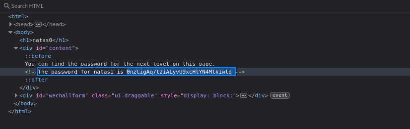

# Natas Level 0 → 1

**Vulnerability:** Information Disclosure via HTML Source Code
**Difficulty:** Trivial
**Tools Used:** Browser DevTools

---

### What the level gives you

The page states that the password for the next level can be found on the page itself.

### Vulnerability explanation

Information disclosure occurs when sensitive data is exposed to users through unintended locations such as source code comments, hidden fields, JavaScript files, or configuration files. Although the information is not visible in the rendered page, it remains accessible to anyone inspecting the HTML source.

### Solution

```http
1. Open Developer Tools or View Page Source.
2. Inspect the HTML source.
3. Locate the hidden HTML comment containing the password.

<!-- The password for natas1 is ... -->
```

### Real-world relevance

Sensitive information is frequently exposed through comments, backup files, client-side code, and forgotten debugging artifacts. During web application assessments, source code inspection is one of the first enumeration steps.

### Screenshot



