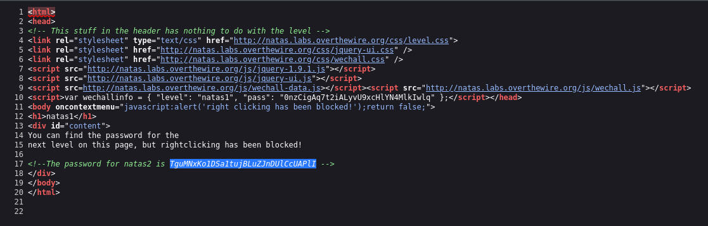

# Natas Level 1 → 2

**Vulnerability:** Client-Side Restriction Bypass
**Difficulty:** Trivial
**Tools Used:** Browser DevTools, View Source

---

### What the level gives you

The page claims that the password can be found on the page but right-clicking has been disabled using client-side JavaScript.

### Vulnerability explanation

Client-side restrictions provide no real security because they execute entirely within the user's browser. Any user can bypass JavaScript-based controls through developer tools, keyboard shortcuts, browser features, or alternative inspection methods.

### Solution

```http
1. Ignore the right-click restriction.
2. Open View Source directly.
3. Inspect the HTML comments.
4. Extract the password for the next level.

```
### Real-world relevance

Client-side controls should never be relied upon for access control or protection of sensitive information. Security decisions must always be enforced on the server side.


### Screenshot

