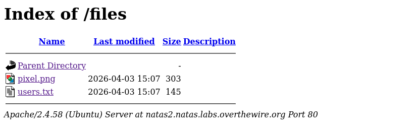

# Natas Level 2 → 3

**Vulnerability:** Directory Listing and Exposed Files
**Difficulty:** Trivial
**Tools Used:** Browser DevTools

---

### What the level gives you

The page itself contains no visible password. Inspecting the source reveals a reference to an image stored inside the `/files/` directory.

### Vulnerability explanation

Directory listing occurs when a web server allows users to browse the contents of a directory. If sensitive files are stored inside publicly accessible locations, attackers can enumerate and retrieve confidential information directly from the web server.

### Solution

```http
GET /files/

1. Inspect page source.
2. Notice the reference to /files/pixel.png.
3. Browse to /files/.
4. Discover users.txt.
5. Open users.txt and retrieve the next password.
```
### Real-world relevance

Misconfigured web servers often expose backup files, credentials, logs, configuration files, and internal documentation through directory indexing. Enumeration of exposed directories is a standard web assessment technique.


### Screenshot

