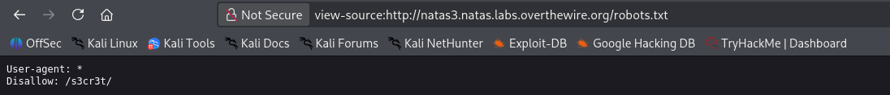

# Natas Level 3 → 4

**Vulnerability:** robots.txt Information Disclosure
**Difficulty:** Trivial
**Tools Used:** Browser, View Source

---

### What the level gives you

The source code contains a hint suggesting that even search engines should not be able to locate the hidden information.

### Vulnerability explanation

The robots.txt file is designed to guide search engine crawlers. It is not a security mechanism. Any path listed inside robots.txt becomes visible to anyone who reads the file and can often reveal sensitive directories or hidden application content.

### Solution

```http
GET /robots.txt

User-agent: *
Disallow: /s3cr3t/

1. Access robots.txt.
2. Discover the hidden directory.
3. Browse to /s3cr3t/.
4. Open users.txt.
5. Retrieve the password.
```

### Real-world relevance

Security through obscurity frequently fails because robots.txt publicly advertises hidden paths. During web reconnaissance, robots.txt is commonly checked for administrative panels, backups, and sensitive resources.


### Screenshot

