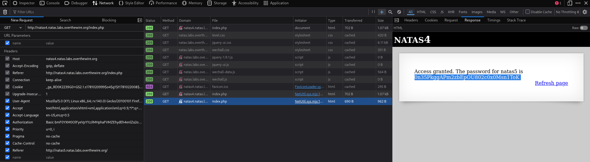

# Natas Level 4 → 5

**Vulnerability:** Broken Access Control via HTTP Referer Header Manipulation
**Difficulty:** Easy
**Tools Used:** Browser DevTools (Network Inspector)
**OWASP Category:** A01:2021 – Broken Access Control

---

## What the level gives you

The page displays an access denied message stating that access is only allowed when arriving from a specific page. Unlike previous levels, the password is not directly exposed in the page source or visible content.

No source code is provided. The only clue is the application's reference to the page from which the request should originate, suggesting that access control may depend on an HTTP header supplied by the client.

---

## Approach

After reading the access denied message, I focused on the HTTP request rather than the page itself. The application specifically mentioned the previous page, which suggested that it might be checking the `Referer` header.

Since HTTP headers are controlled by the client and can be modified before being sent to the server, I suspected the application was trusting the `Referer` value as an authorization mechanism. I opened the browser's Network Inspector and reviewed the request headers being sent to the application.

The original request did not contain the expected value. I manually modified the `Referer` header to match the page referenced by the application and resent the request. Once the modified request was processed, the server granted access and revealed the password for the next level.

---

## Exploitation

Using the browser's Network Inspector, I created a new HTTP request and modified the `Referer` header before sending it to the application.

```http
GET /index.php HTTP/1.1
Host: natas4.natas.labs.overthewire.org
Authorization: Basic <base64_credentials>

Referer: http://natas5.natas.labs.overthewire.org/
```

The application trusted the client-supplied `Referer` header and granted access when the expected value was provided.

The response contained the password for Natas5.

---

## Screenshot



---

## Real-world relevance

This vulnerability falls under **OWASP A01:2021 – Broken Access Control** because the application makes authorization decisions using a client-controlled HTTP header.

Referer-based access control has appeared in legacy web applications, internal administration panels, and poorly designed download portals. During real penetration tests, attackers frequently bypass such controls by spoofing HTTP headers because browsers, proxies, and custom clients allow these values to be modified easily.

Any security mechanism that relies solely on client-supplied data can be manipulated and should not be trusted for authorization decisions.

---

## Defender's Perspective

Authorization decisions should always be based on authenticated server-side session data rather than HTTP headers supplied by the client.

The `Referer` header should be treated as informational only and never used as an authentication or authorization mechanism. Proper role-based access control and session validation eliminate this class of vulnerability.

A WAF may detect suspicious header manipulation attempts, but the correct fix is removing header-based authorization checks entirely and enforcing access control on the server.

---

## What I'd Do Differently

This level was straightforward once the hint about the previous page was identified. In a larger application, I would automate header manipulation testing using a proxy or scripted requests to quickly identify other endpoints that trust client-controlled headers.
