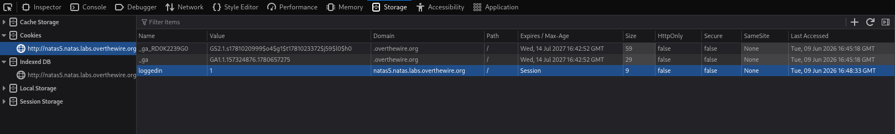
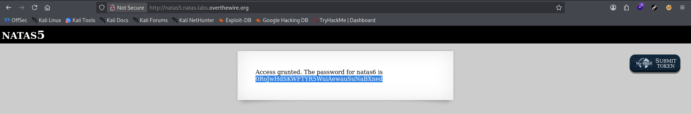

# Natas Level 5 → 6

**Vulnerability:** Client-side Authentication Bypass via Cookie Manipulation  
**Difficulty:** Easy  
**Tools Used:** Browser Developer Tools  
**OWASP Category:** A07 – Identification and Authentication Failures

---

## What the level gives you

The application displays a message indicating that access is denied because the user is not logged in.

No login functionality is provided. The page contains no visible input fields or authentication mechanism, suggesting that access control may be handled elsewhere within the browser session.

The objective is to obtain the password for the next level.

---

## Approach

My first observation was that the application explicitly stated that I was not logged in, despite never presenting a login page.

This suggested that the application's authentication state might be stored on the client side. Since cookies are commonly used to track session state, I inspected the browser storage using Developer Tools.

A cookie named `loggedin` was present with the value `0`.

The naming convention strongly suggested a boolean authentication flag. Instead of attempting to discover additional functionality, I modified the value from `0` to `1` and refreshed the page.

The application immediately granted access and revealed the password for the next level.

The key realization was that the server trusted a client-controlled authentication indicator without performing independent verification.

---

## Exploitation

### Inspect existing cookies

Open browser Developer Tools:

```text
Storage
└── Cookies
    └── loggedin=0
```

### Modify authentication state

```text
loggedin=1
```

### Refresh page

The server now treats the request as authenticated and returns the next password.

---

## Screenshot

### Modified authentication cookie



### Password disclosure after refresh



---

## Real-world relevance

This vulnerability is an example of Broken Authentication and Identification Failures where an application trusts client-supplied authentication state.

Similar issues have historically appeared in legacy administrative portals, internal business applications, and poorly implemented custom authentication systems where cookies directly store authorization decisions.

In a professional VAPT engagement, a finding of this type would typically be classified as a critical authentication bypass because an attacker can elevate privileges without valid credentials.

---

## Defender's perspective

Authentication decisions should never rely solely on client-controlled values.

Instead of storing authorization state directly inside a cookie, the application should issue a cryptographically random session identifier and validate the user's authentication status server-side.

Signed session tokens, secure session management frameworks, and server-side authorization checks prevent this class of vulnerability.

A WAF would generally not detect this issue because the request itself appears legitimate. Proper session architecture is the required fix.

---

## What I'd do differently

If browser storage inspection had not revealed the issue immediately, I would have intercepted the request using Burp Suite and compared the server response while modifying cookies one at a time.