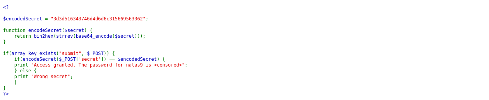
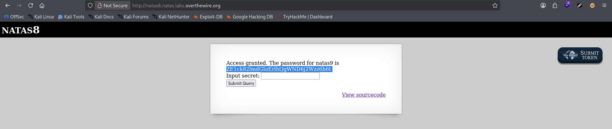

# Natas Level 8 → 9

**Vulnerability:** Information Disclosure through Exposed Source Code
**Difficulty:** Easy
**Tools Used:** Browser, Source Code Review, PHP, Hex/Base64 Decoding
**OWASP Category:** A05 – Security Misconfiguration

---

## What the level gives you

The page presents a form requesting a secret value.

A source code link is available, allowing inspection of the application's implementation.

The objective is to discover the correct secret and retrieve the password for the next level.

---

## Source code analysis

The application contains the following logic:

```php
$encodedSecret = "3d3d516343746d4d6d6c315669563362";

function encodeSecret($secret) {
    return bin2hex(strrev(base64_encode($secret)));
}

if(array_key_exists("submit", $_POST)) {
    if(encodeSecret($_POST['secret']) == $encodedSecret) {
        print "Access granted. The password for natas9 is <censored>";
    } else {
        print "Wrong secret";
    }
}
```

---

## Understanding the encoding process

The application does not store the secret directly.

Instead, it stores an encoded version and transforms user input before comparison.

The encoding pipeline is:

```text
Secret
   ↓
base64_encode()
   ↓
strrev()
   ↓
bin2hex()
   ↓
Stored Value
```

The stored value is:

```text
3d3d516343746d4d6d6c315669563362
```

To recover the original secret, the process must be reversed.

---

## Reverse engineering the secret

### Step 1 – Convert Hex to Text

Stored value:

```text
3d3d516343746d4d6d6c315669563362
```

Convert hexadecimal back to ASCII:

```bash
echo "3d3d516343746d4d6d6c315669563362" | xxd -r -p
```

Output:

```text
==QcCmMm1ViV3b
```

---

### Step 2 – Reverse the String

The source code uses:

```php
strrev()
```

Reverse the output:

```bash
echo "==QcCmMm1ViV3b" | rev
```

Output:

```text
b3ViV1lmMm1tCcQ==
```

---

### Step 3 – Base64 Decode

The source code uses:

```php
base64_encode()
```

Reverse the operation:

```bash
echo "b3ViV1lmMm1tCcQ==" | base64 -d
```

Output:

```text
oubWYf2kBq
```

This reveals the original secret value.

---

## Approach

The source code immediately revealed that no brute force attack was required.

Instead of comparing input directly, the application encoded user input using a custom sequence of transformations.

Rather than attempting to guess the secret, I analyzed the encoding pipeline and reversed each operation in the opposite order.

Once the original value was recovered, I submitted it through the form and obtained the password for the next level.

The challenge demonstrates that encoding is not encryption and that exposing implementation details often allows attackers to reconstruct protected values.

---

## Exploitation

### Recover secret

```bash
echo "3d3d516343746d4d6d6c315669563362" | xxd -r -p
```

```text
==QcCmMm1ViV3b
```

```bash
echo "==QcCmMm1ViV3b" | rev
```

```text
b3ViV1lmMm1tCcQ==
```

```bash
echo "b3ViV1lmMm1tCcQ==" | base64 -d
```

```text
oubWYf2kBq
```

### Submit recovered value

```http
POST / HTTP/1.1
Host: natas8.natas.labs.overthewire.org
Content-Type: application/x-www-form-urlencoded

secret=oubWYf2kBq&submit=Submit+Query
```

### Result

```text
Access granted.
The password for natas9 is ...
```

---

## Screenshot

### Source code disclosure



### Reversing the encoded secret


### Password retrieval



---

## Real-world relevance

A common misconception among developers is that encoded data is secure.

Techniques such as:

```text
Base64
Hex Encoding
ROT13
URL Encoding
String Reversal
```

provide no meaningful security because they are fully reversible.

Attackers routinely recover API keys, credentials, session tokens, and application secrets when developers mistake encoding for encryption.

This issue becomes significantly worse when source code, configuration files, or implementation details are exposed.

---

## Defender's perspective

Secrets should never be protected using reversible encoding schemes.

Sensitive values should instead be:

- Stored securely server-side
- Protected with strong cryptographic controls
- Excluded from publicly accessible source code
- Managed through dedicated secret management systems

Developers should assume that any client-visible code can be inspected and analyzed by attackers.

Security should never depend on hiding reversible transformations.

---

## What I'd do differently

If the transformation chain had been more complex, I would have reproduced the encoding function locally and systematically reversed each stage until the original input was recovered.

For more advanced applications, I would also inspect JavaScript files, API responses, and client-side logic for similar disclosure opportunities.