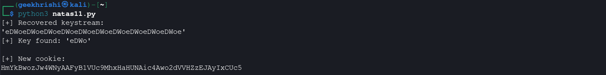
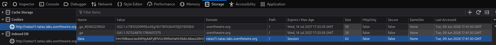
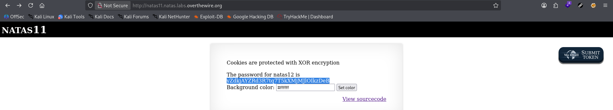

# Natas Level 11 → 12

**Vulnerability:** Weak XOR Cookie Encryption / Cookie Forgery
**Difficulty:** Medium
**Tools Used:** Firefox DevTools, Python
**OWASP Category:** A02:2021 – Cryptographic Failures

---

## What the level gives you

The application stores user preferences inside a cookie named `data`.

The source code reveals that cookie values are XOR encrypted and Base64 encoded. A hidden feature displays the next password when the value `showpassword=yes` is present.

The objective is to forge a valid cookie that enables this hidden functionality.

---

## Source code analysis

```php
$defaultdata = array(
  "showpassword"=>"no",
  "bgcolor"=>"#ffffff"
);
```

The application stores user-controlled data inside a cookie. By default, the `showpassword` field is set to `"no"`.

```php
setcookie("data",
base64_encode(xor_encrypt(json_encode($d))));
```

Before being stored, the JSON data is XOR encrypted and Base64 encoded.

```php
function xor_encrypt($in) {
    $key = "<secret>";
```

The application uses a repeating XOR key to encrypt and decrypt cookie contents.

This design is vulnerable because XOR encryption provides confidentiality only when the key remains secret and is never reused. Since the plaintext structure of the cookie is known, XOR properties allow the recovery of the keystream and ultimately the repeating key itself.

Once the key is recovered, arbitrary cookie values can be encrypted and forged.

---

## Approach

I first inspected the `data` cookie stored by the application and reviewed the provided source code.

The code revealed the exact JSON structure expected by the application:

```json
{"showpassword":"no","bgcolor":"#ffffff"}
```

Since XOR encryption is reversible when plaintext is known, I used the default cookie value as known plaintext and XORed it against the decoded cookie contents to recover the keystream.

After analyzing the keystream, I identified the repeating XOR key:

```text
eDWo
```

With the key recovered, I generated a new cookie containing:

```json
{"showpassword":"yes","bgcolor":"#ffffff"}
```

The forged cookie was then inserted into the browser using Firefox DevTools.

---

## Exploitation

I used a Python script to recover the XOR key directly from the encrypted cookie and generate a forged cookie containing `showpassword=yes`.

```python
#!/usr/bin/env python3

import base64

cookie = "HmYkBwozJw4WNyAAFyB1VUcqOE1JZjUIBis7ABdmbU1GIjEJAyIxTRg="

known_plaintext = '{"showpassword":"no","bgcolor":"#ffffff"}'

ciphertext = base64.b64decode(cookie)

# Recover the XOR keystream using the known plaintext
key_stream = ''.join(
    chr(ciphertext[i] ^ ord(known_plaintext[i]))
    for i in range(len(known_plaintext))
)

print("[+] Recovered keystream:")
print(repr(key_stream))

# Identify the repeating XOR key
for key_len in range(1, 20):
    candidate = key_stream[:key_len]

    if all(key_stream[i] == candidate[i % key_len]
           for i in range(len(key_stream))):
        key = candidate
        print(f"[+] Key found: {repr(key)}")
        break

# Forge a new cookie with showpassword=yes
new_plaintext = '{"showpassword":"yes","bgcolor":"#ffffff"}'

encrypted = ''.join(
    chr(ord(new_plaintext[i]) ^ ord(key[i % len(key)]))
    for i in range(len(new_plaintext))
)

new_cookie = base64.b64encode(
    encrypted.encode('latin1')
).decode()

print("\n[+] New cookie:")
print(new_cookie)
```

The script recovered the repeating XOR key:

```text
eDWo
```

Using that key, a forged cookie was generated containing:

```json
{"showpassword":"yes","bgcolor":"#ffffff"}
```

I replaced the original `data` cookie with the forged value using Firefox DevTools and refreshed the page.

The application accepted the modified cookie and revealed the password for Natas12.

---

## Screenshot

### Recovered XOR key and forged cookie generation



### Password disclosure after cookie forgery




---

## Real-world relevance

This vulnerability falls under **OWASP A02:2021 – Cryptographic Failures**.

Encryption alone does not provide integrity. Many legacy applications incorrectly assume encrypted cookies cannot be modified. Attackers routinely exploit weak or custom cryptographic schemes to forge authentication tokens, privilege flags, and session attributes.

Similar issues have appeared in applications using homegrown encryption mechanisms instead of established cryptographic standards. Modern applications use authenticated encryption or digitally signed tokens to prevent this class of attack.

---

## Defender's perspective

Custom cryptographic implementations should be avoided entirely.

Sensitive cookies should use authenticated encryption or signed tokens that provide both confidentiality and integrity guarantees. Framework-supported session management mechanisms are significantly safer than homemade XOR implementations.

Authorization decisions should never rely on client-controlled values that can be modified and resubmitted by an attacker. Storing security-sensitive state on the server side eliminates this risk.

---

## What I'd do differently

The known-plaintext attack was straightforward because the source code revealed the exact cookie structure. In a real-world assessment where the plaintext format is unknown, I would spend more time enumerating predictable fields and analyzing multiple encrypted cookie values to recover the key efficiently.
